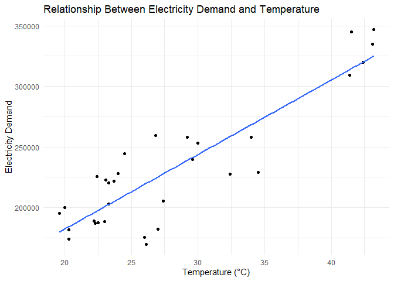
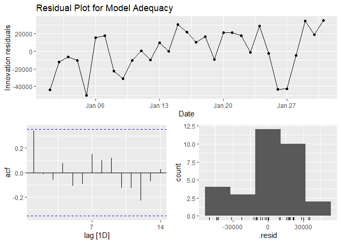
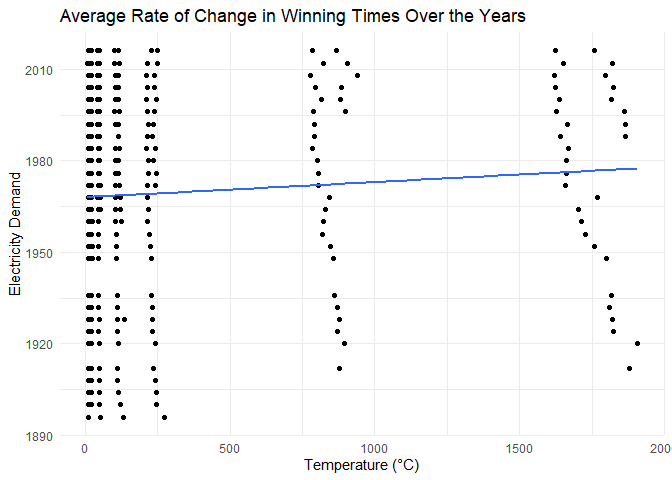

Time Series Linear Model Applied
================

## Exploring Time Series Data with R

Welcome to the first assignment of our Time Series Analysis class. In
this assignment, we’ll be working with real-world time series data to
understand the concepts of linear modeling, regression, and forecasting.
We’ll use the R programming language to perform these tasks.

### Section 1: Analyzing Electricity Demand for Australia

Our journey begins with the task of extracting and aggregating time
series data. We’re going to work with half-hourly electricity demand
data for Victoria, Australia. Specifically, we’ll focus on the demand
data for January 2014 and aggregate it to daily totals, along with
maximum temperature information.

#### Extracting and Aggregating Data

``` r
jan_vic_elec <- vic_elec %>%
     filter(yearmonth(Time) == yearmonth("2014 Jan")) %>%
     index_by(Date = as_date(Time)) %>%
     summarise(Demand = sum(Demand), Temperature = max(Temperature))
```

#### Plotting and Understanding the Regression Model

Now that we have our data ready, it’s time to visualize it. We’ll create
a plot to explore the relationship between electricity demand and
temperature. Additionally, we’ll find a regression model to explain why
there’s a positive relationship between these two variables.

``` r
# Use tslm function to find the regression model
fit <- jan_vic_elec %>%
  model(tlsm= TSLM (Demand ~ Temperature))

report(fit)
```

    ## Series: Demand 
    ## Model: TSLM 
    ## 
    ## Residuals:
    ##      Min       1Q   Median       3Q      Max 
    ## -49978.2 -10218.9   -121.3  18533.2  35440.6 
    ## 
    ## Coefficients:
    ##             Estimate Std. Error t value Pr(>|t|)    
    ## (Intercept)  59083.9    17424.8   3.391  0.00203 ** 
    ## Temperature   6154.3      601.3  10.235 3.89e-11 ***
    ## ---
    ## Signif. codes:  0 '***' 0.001 '**' 0.01 '*' 0.05 '.' 0.1 ' ' 1
    ## 
    ## Residual standard error: 24540 on 29 degrees of freedom
    ## Multiple R-squared: 0.7832,  Adjusted R-squared: 0.7757
    ## F-statistic: 104.7 on 1 and 29 DF, p-value: 3.8897e-11

``` r
# Plot data
jan_vic_elec %>%
  ggplot(aes(x=Temperature, y=Demand)) +
    ylab("Electricity Demand") +
    xlab("Temperature") +
    geom_point() +
    geom_smooth(method="lm", se=FALSE) +
  #this gives us a line of best fit
#the estimated regression line makes the positive relationship more evident
  theme_minimal() +
  labs(title = "Relationship Between Electricity Demand and Temperature", x= "Temperature (°C)")
```

<!-- -->

*Why is there a positive relationship?*

I assume the positive relationship indicates the use of air
conditioning. For example, in summer months when it is more hot, people
increase their AC unit usage by having the fan on more constantly and at
lower temperatures, thus increasing the use of electricity.

#### Assessing Model Adequacy

Creating a regression model is just the beginning. To ensure that our
model is adequate, we need to produce a residual plot. This plot will
help us identify any outliers or influential observations that could
affect the validity of our model.

``` r
# Plot residuals
gg_tsresiduals(fit)+
   labs(title = "Residual Plot for Model Adequacy") 
```

<!-- -->

*Is the model adequate?*

Yes, the model is adequate. The first plot appears random, with no
patterns. In the autocorrelation plot, no spikes cross the blue lines.
The final plot is somewhat left skewed, which could point to outliers.

#### Forecasting Electricity Demand

Now, let’s put our model to use. We’ll use it to forecast electricity
demand for two scenarios: one with a maximum temperature of
$15^\circ\text{C}$ and another with a maximum temperature of
$35^\circ\text{C}$. But the question is, can we trust these forecasts?

``` r
# Create new future scenarios
future_scenarios <- scenarios(
  'cold' = new_data(jan_vic_elec, 1) %>% #creating one new data 
    mutate(Temperature = 15), #adding temp of 15 to original data
  'hot' = new_data(jan_vic_elec, 1) %>%
    mutate(Temperature = 35))

# Forecast new scenarios
forecast_future<- fit %>%
  forecast(new_data = future_scenarios)

# Plot
autoplot(jan_vic_elec, Demand) +
  autolayer(forecast_future) +
  theme_minimal() +
  labs(title = "Electricity Demand Forecast for Different Temperature Scenarios", x= "Date", y="Demand")
```

<!-- -->

*Do you believe these forecasts?*

I believe the forecasts for the 35∘C. I doubt it would get to 20∘C in
the summer months.

#### Providing Prediction Intervals

To enhance our forecasts, we’ll calculate prediction intervals. This
step adds a layer of uncertainty to our predictions, helping us
understand the potential range of outcomes.

``` r
forecast_future %>%
  hilo() %>%
  select(-.model)
```

    # A tsibble: 2 x 7 [1D]
    # Key:       .scenario [2]
      .scenario Date                   Demand   .mean Temperature
      <chr>     <date>                 <dist>   <dbl>       <dbl>
    1 cold      2014-02-01 N(151398, 6.8e+08) 151398.          15
    2 hot       2014-02-01 N(274484, 6.4e+08) 274484.          35
    # ℹ 2 more variables: `80%` <hilo>, `95%` <hilo>

#### Analyzing Demand vs. Temperature

Lastly, we’ll visualize the relationship between demand and temperature
for all available data. This broader perspective will shed light on the
overall behavior of our model.

``` r
vic_elec %>% # full dataset
  index_by(Date = as_date(Time)) %>% # index by time
  summarise( # summarize demand and temperature
    Demand = sum(Demand),
    Temperature = max(Temperature)
  ) %>%
  ggplot(aes(x = Temperature, y = Demand)) +
  geom_point() +
  theme_minimal()  +
  labs(title = "Electricity Demand vs. Temperature for All Available Data", x= "Temperature (°C)")
```

<!-- -->

*What does this say about our model?*

The scatterplot indicates that the relationship between electricity
demand and daily max temperature is in fact, not linear. This means that
the assumption of linearity we made previously is incorrect, and that a
linear model won’t fit this data.

### Section 2: Analyzing Olympic Running Times

In the second part of our assignment, we’ll shift our focus to analyzing
Olympic running times spanning from 1896 to 2016.

#### Visualizing Winning Times Over the Years

``` r
olympic_running %>%
  ggplot(aes(x = Year, y = Time, colour = Sex)) +
  geom_line() +
  geom_point(size = 1) +
  facet_wrap(~Length, scales = "free_y", nrow = 2) +
  theme_minimal() +
  scale_color_brewer(palette = "Dark2") +
  theme(legend.position = "bottom", legend.title = element_blank()) +
  labs(y = "Running time (seconds)") +
  theme_minimal()+
  labs(title = "Winning Times Over the Years")
```

<!-- -->

*What are the main features of this plot?* For each plot, men are faster
than women, and over time both genders are getting faster. The rate of
decline is less severe from 1980-on.

#### Calculating the Average Rate of Change

A key question we aim to answer in this part is: how have winning times
been changing over the years on average? We’ll fit regression lines to
the data to determine the average rate of change per year for each event
category and gender.

``` r
# Fit time series linear model
fit2 <- olympic_running %>%
  model(tlsm = TSLM(Time ~ trend()))

report(fit2)
```

    # A tibble: 14 × 17
       Length Sex   .model r_squared adj_r_squared   sigma2 statistic  p_value    df
        <int> <chr> <chr>      <dbl>         <dbl>    <dbl>     <dbl>    <dbl> <int>
     1    100 men   tlsm     0.810          0.803    0.0539  111.     7.24e-11     2
     2    100 women tlsm     0.751          0.738    0.0498   57.4    3.72e- 7     2
     3    200 men   tlsm     0.883          0.878    0.110   189.     3.80e-13     2
     4    200 women tlsm     0.686          0.667    0.251    35.0    2.17e- 5     2
     5    400 men   tlsm     0.823          0.817    1.29    121.     2.75e-11     2
     6    400 women tlsm     0.316          0.259    1.06      5.54   3.65e- 2     2
     7    800 men   tlsm     0.746          0.736   11.5      73.5    6.47e- 9     2
     8    800 women tlsm     0.655          0.631   11.6      26.6    1.45e- 4     2
     9   1500 men   tlsm     0.686          0.674   65.5      56.9    5.23e- 8     2
    10   1500 women tlsm     0.161          0.0769  25.7       1.92   1.96e- 1     2
    11   5000 men   tlsm     0.816          0.808  245.       97.6    1.50e- 9     2
    12   5000 women tlsm     0.00762       -0.240  837.        0.0307 8.69e- 1     2
    13  10000 men   tlsm     0.897          0.893  835.      192.     2.37e-12     2
    14  10000 women tlsm     0.806          0.774  330.       24.9    2.47e- 3     2
    # ℹ 8 more variables: log_lik <dbl>, AIC <dbl>, AICc <dbl>, BIC <dbl>,
    #   CV <dbl>, deviance <dbl>, df.residual <int>, rank <int>

``` r
olympic_running %>%
  ggplot(aes(x=Time, y=Year)) +
    ylab("Electricity Demand") +
    xlab("Temperature") +
    geom_point() +
  ## adding a line of best fit
    geom_smooth(method="lm", se=FALSE) + 
    theme_minimal() +
    labs(title = "Average Rate of Change in Winning Times Over the Years", x= "Temperature (°C)")
```

<!-- -->

The men’s 100 running time has been decreasing by an average of 0.013
seconds each year.<br> The women’s 100 running time has been decreasing
by an average of 0.014 seconds each year.<br> The men’s 200 running time
has been decreasing by an average of 0.025 seconds each year.<br> The
women’s 200 running time has been decreasing by an average of 0.034
seconds each year.<br> The men’s 400 running time has been decreasing by
an average of 0.065 seconds each year.<br> The women’s 400 running time
has been decreasing by an average of 0.04 seconds each year.<br> The
men’s 800 running time has been decreasing by an average of 0.152
seconds each year.<br> The women’s 800 running time has been decreasing
by an average of 0.198 seconds each year.<br> The men’s 1500 running
time has been decreasing by an average of 0.315 seconds each year.<br>
The women’s 1500 running time has been increasing by an average of 0.147
seconds each year.<br> The men’s 5000 running time has been decreasing
by an average of 1.03 seconds each year.<br> The women’s 5000 running
time has been decreasing by an average of 0.303 seconds each year.<br>
The men’s 10000 running time has been decreasing by an average of 2.666
seconds each year.<br> The women’s 10000 running time has been
decreasing by an average of 3.496 seconds each year.<br>

### Assessing Residuals

To further evaluate our models, we’ll plot the residuals against the
year. This will help us understand whether our models are suitable for
the data.

``` r
augment(fit2) %>%
  ggplot(aes(x = Year, y = .innov, colour = Sex)) +
  geom_line() +
  geom_point(size = 1) +
  facet_wrap(~Length, scales = "free_y", nrow = 2) +
  theme_minimal() +
  scale_color_brewer(palette = "Dark2") +
  theme(legend.position = "bottom", legend.title = element_blank()) +
  theme_minimal()  +
  labs(title = "Residual Plot for Model Adequacy")
```

<!-- -->

*What do the residuals indicate about our models?*

Because the plots show different patterns with spikes at different time
spots, the linear trend doesn’t seem to fit the data.

### Predicting Winning Times for 2020 Olympics

``` r
fit2 %>%
  forecast(h = 1) %>%
  mutate(PI = hilo(Time, 95)) %>%
  select(-.model)
```

    # A fable: 14 x 6 [4Y]
    # Key:     Length, Sex [14]
       Length Sex    Year          Time   .mean                          PI
        <int> <chr> <dbl>        <dist>   <dbl>                      <hilo>
     1    100 men    2020 N(9.5, 0.061)    9.53 [   9.049446,   10.01957]95
     2    100 women  2020  N(11, 0.059)   10.5  [  10.056992,   11.01183]95
     3    200 men    2020   N(19, 0.13)   19.1  [  18.423087,   19.81179]95
     4    200 women  2020   N(21, 0.31)   21.2  [  20.106551,   22.29293]95
     5    400 men    2020    N(42, 1.5)   42.0  [  39.668596,   44.41603]95
     6    400 women  2020    N(48, 1.4)   48.4  [  46.123295,   50.74923]95
     7    800 men    2020     N(99, 13)   99.2  [  92.137378,  106.33802]95
     8    800 women  2020    N(111, 14)  111.   [ 104.105124,  118.86174]95
     9   1500 men    2020    N(207, 74)  207.   [ 190.091940,  223.90462]95
    10   1500 women  2020    N(245, 35)  245.   [ 233.786710,  257.12632]95
    11   5000 men    2020   N(773, 285)  773.   [ 739.735488,  805.91363]95
    12   5000 women  2020  N(892, 1562)  892.   [ 814.664722,  969.56461]95
    13  10000 men    2020  N(1580, 970) 1580.   [1519.300480, 1641.40196]95
    14  10000 women  2020  N(1763, 530) 1763.   [1717.895285, 1808.13543]95

*What assumptions have we made in these calculations? We’ll discuss the
validity of our predictions and assess their reasonableness.*

In the calculations, we assume that the linear trend of decreasing times
will continue to happen over the years. However, realistically this is
not possible and is unrealistic.

The residual plots showed large residuals for the most recent 20 years,
which indicates that theses winning times aren’t linear, and that the
linear model isn’t appropriate for further analysis.

### Section 3: Analyzing Souvenirs Sales Data

In the third and final part of our assignment, we’ll dive into the world
of souvenirs sales data. This dataset provides monthly sales figures for
a shop located on the wharf at a beach resort town in Queensland,
Australia. The shop sells gifts, souvenirs, and novelties, and its sales
volume varies with the seasonal population of tourists. Notably, the
town experiences a surge in visitors during Christmas and the local
surfing festival held every March since 1988. The shop has also evolved
over time, expanding its premises, product range, and staff.

#### Understanding the Data Patterns

Our journey begins with a time plot of the sales data. By visualizing
the data, we aim to identify patterns and uncover any unusual
fluctuations in the time series.

``` r
# Plot `souvenirs` data and plot `Sales`
souvenirs %>% 
  autoplot(Sales)+
  theme_minimal()  +
  labs("Monthly Souvenirs Sales Data Over Time", x= "Date")
```

<!-- -->

*Patterns in data*

- The data exhibits a clear seasonal pattern that repeats approximately
  every year.

- There’s a noticeable spike in sales during December of each year.

- Starting from 1992, the data shows rapid growth.

#### The Importance of Logarithmic Transformation

Before fitting a regression model, it’s essential to explain why we need
to take logarithms of the sales data. This transformation is necessary
to convert the data from an exponential growth model to a linear growth
model. Additionally, taking logarithms stabilizes the pattern and
variance in the data.

``` r
# Taking logarithm of the data (and plot)
souvenirs %>% autoplot(log(Sales)) +
  theme_minimal() +
  labs("Logarithmic Transformation of Monthly Souvenirs Sales Data", x= "Date", y= "Log (sales)")
```

<!-- -->

*After taking the log:*

- The trend appears more linear.

- Seasonal variation becomes more constant.

- The December spike in sales becomes more evident.

#### Fitting a Regression Model

Our final task in this assignment is to fit a regression model to the
logarithms of the sales data. This model will incorporate a linear
trend, seasonal dummies, and a “surfing festival” dummy variable to
account for the impact of the annual surfing festival.

``` r
# Data with festival 
souvenirs_festival <- souvenirs %>%
  mutate(festival = month(Month) == 3 & year(Month) != 1987)

# Fit model with trend (log), season, and festival
fit <- souvenirs %>%
  model(reg = TSLM(log(Sales) ~ trend() + season() + festival))

# Plot fitted model with `souvenirs` data
# Plot `Sales`
souvenirs %>%
  autoplot(log(Sales), col = "gray") +
  geom_line(data = augment(fit), aes(x = Month, y = .fitted), col = "blue") +
  labs(x = "Time", y = "Log(Sales)") +
  theme_minimal() +
  ggtitle("Fitted Regression Model for Souvenirs Sales Data")
```

<!-- -->

This regression model will help us understand the underlying factors
influencing souvenir sales in this coastal town.

### Conclusion

This concludes our exploration of Assignment 1. By working through these
tasks, we’ve gained valuable insights into time series analysis,
regression modeling, and forecasting. Stay tuned for more assignments as
we dive deeper into the fascinating world of time series data analysis!
