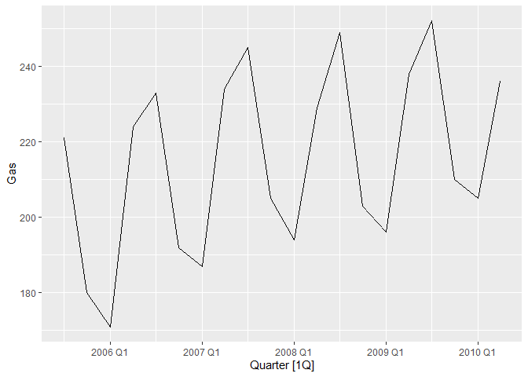
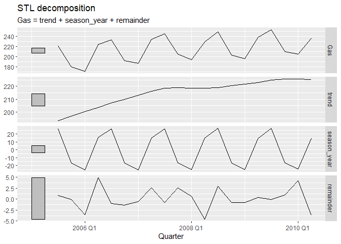
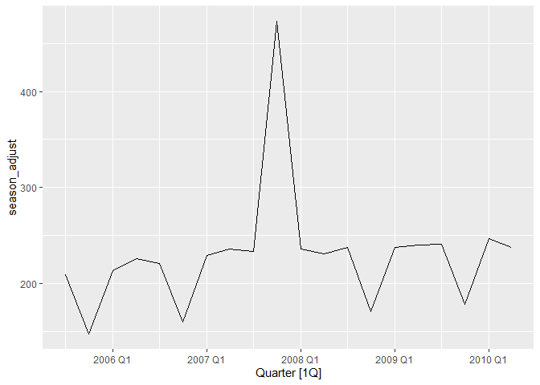
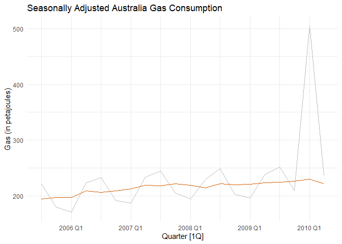
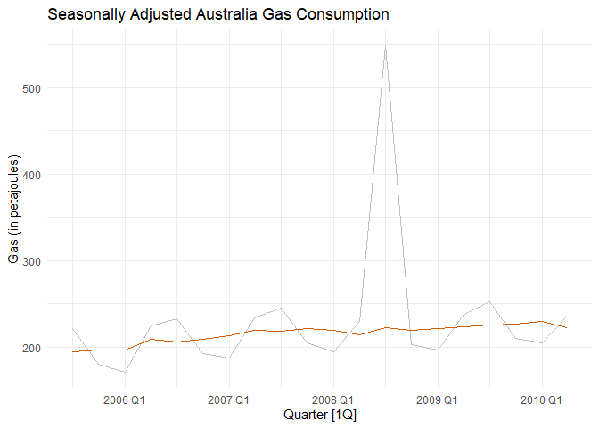
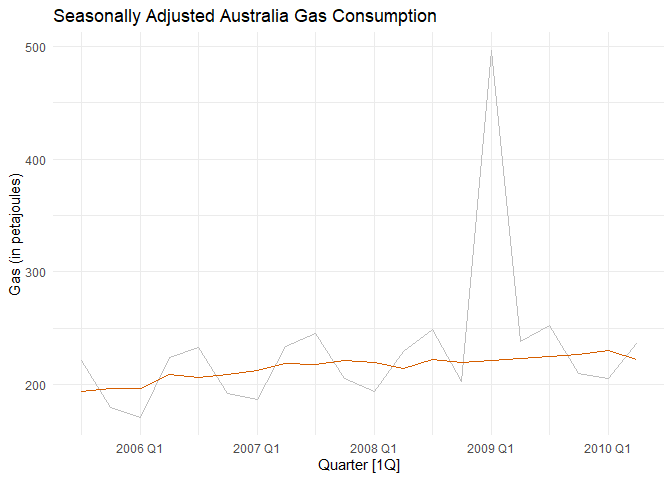
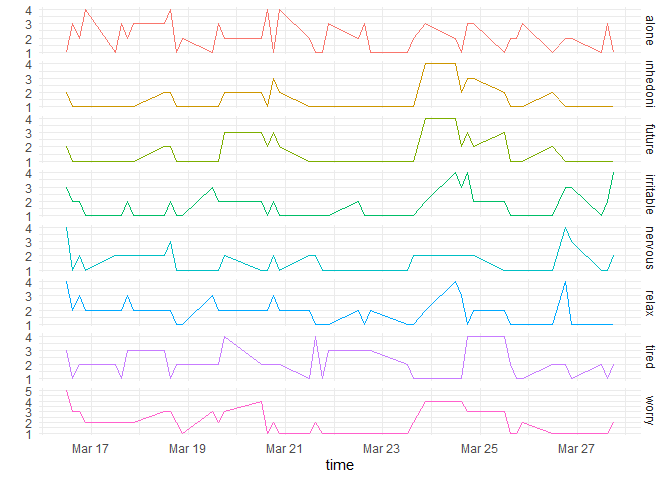
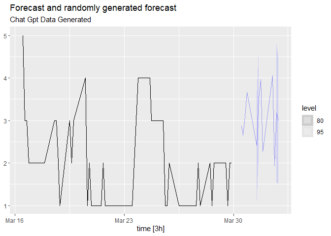
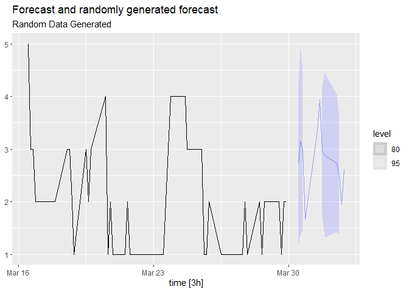

Forecasting Decomposition
================
Rachel Montgomery
2023-10-08

## Understanding Forecasting Decomposition: A Practical Guide

Forecasting is an essential tool in the world of data analysis and
decision-making. It allows us to predict future trends and make informed
choices based on historical data. One important aspect of forecasting is
decomposition, which helps us break down complex time series data into
its fundamental components: trend, seasonality, and residuals. In this
blog post, we’ll walk through a real-world assignment that demonstrates
how to perform forecasting decomposition using R.

### Section 1: Gas Production Data

We’ll begin by considering the last five years of the Gas production
data from aus_production. Let’s load the data and take a look at it.

#### Data Loading

``` r
gas <- tail(aus_production, 5*4) %>% select(Gas)
```

#### Plotting the Time Series

Let’s start by plotting the time series to identify any seasonal
fluctuations and trends.

``` r
# Plot time series
gas %>%
autoplot(Gas)
```

<!-- -->

From the plot, we can observe an upward trend with quarterly
seasonality.

#### Decomposition with Seasonal-Trend using Loess (STL)

Now, we will use STL to decompose the time series into its trend-cycle
and seasonal components.

``` r
# Store components
gas_components <- gas %>%
  model(stl = STL(Gas))

# STL decomposition
gas %>%
model(STL(Gas)) %>%
components() %>%
  autoplot()
```

<!-- -->

#### Interpretation of Decomposition

*Do the results from the decomposition support the graphical
interpretation?*

Yes, after the STL decomposition, we can see the upward trend and the
quarterly seasonality in the decomposition components.

#### Seasonally Adjusted Data

Now, let’s compute and plot the seasonally adjusted data using the STL
decomposition.

``` r
gas %>%
model(STL(Gas)) %>%
components() %>%
as_tsibble() %>%
autoplot(season_adjust)
```

<!-- -->

#### Effect of Adding an Outlier

Let’s change one observation to be an outlier (e.g., add 300 to one
observation) and recompute the seasonally adjusted data. We’ll examine
the effect of this outlier on the time series.

``` r
# Add outlier (done for you)
gas_outlier <- gas %>%
mutate(Gas = if_else(Quarter == yearquarter("2007Q4"), Gas + 300, Gas))
# Replot seasonally adjusted data using STL
gas_outlier %>%
model(STL(Gas)) %>%
components() %>%
as_tsibble() %>%
autoplot(season_adjust)
```

<!-- -->

*What is the effect of the outlier, relative to the original seasonally
adjusted plot?*

Adding the outlier of 300 created a large spike in the data from 2007 to
2008. It also lowered the seasonal adjustment to 200, and made the trend
decrease drastically, so the adjustment almost appears constant. The
effect is similar to that of a pool - once a large dent was created, the
rest of the plot had to “balance itself out” by lowering the values
around the spike.

#### Effect of Outlier Position

Does it make any difference if the outlier is near the end rather than
in the middle of the time series? Let’s investigate this by adding
outliers at different positions in the data.

``` r
# Add an outlier at the beginning
gas_outlier <- gas %>%
  mutate(Gas = if_else(Quarter == yearquarter("2006Q2"), Gas + 300, Gas))
  
# Replot the seasonally adjusted data using STL
gas_outlier %>%
  autoplot(Gas, color = 'gray') +
  autolayer(
    components(gas_components),
    season_adjust, # plot season adjustment
    color = '#D55E00'
  ) +
  labs(
    y = "Gas (in petajoules)",
    title = "Seasonally Adjusted Australia Gas Consumption"
  ) +
  theme_minimal()
```

<!-- -->

``` r
# Add an outlier at the end 
gas_outlier <- gas %>%
  mutate(Gas = if_else(Quarter == yearquarter("2010Q1"), Gas + 300, Gas))
  
# Replot the seasonally adjusted data using STL
gas_outlier %>%
  autoplot(Gas, color = 'gray') +
  autolayer(
    components(gas_components),
    season_adjust, # plot season adjustment
    color = '#D55E00'
  ) +
  labs(
    y = "Gas (in petajoules)",
    title = "Seasonally Adjusted Australia Gas Consumption"
  ) +
  theme_minimal()
```

<!-- -->

``` r
# Add an outlier in the first 1/3 of the data 
gas_outlier <- gas %>%
  mutate(Gas = if_else(Quarter == yearquarter("2008Q3"), Gas + 300, Gas))
  
# Replot the seasonally adjusted data using STL
gas_outlier %>%
  autoplot(Gas, color = 'gray') +
  autolayer(
    components(gas_components),
    season_adjust, # plot season adjustment
    color = '#D55E00'
  ) +
  labs(
    y = "Gas (in petajoules)",
    title = "Seasonally Adjusted Australia Gas Consumption"
  ) +
  theme_minimal()
```

<!-- -->

``` r
# Add an outlier in the last 3/4 of data
gas_outlier <- gas %>%
  mutate(Gas = if_else(Quarter == yearquarter("2009Q1"), Gas + 300, Gas))
  
# Replot the seasonally adjusted data using STL
gas_outlier %>%
  autoplot(Gas, color = 'gray') +
  autolayer(
    components(gas_components),
    season_adjust, # plot season adjustment
    color = '#D55E00'
  ) +
  labs(
    y = "Gas (in petajoules)",
    title = "Seasonally Adjusted Australia Gas Consumption"
  ) +
  theme_minimal()
```

<!-- -->

*General patterns we see*

Regardless of where the outlier is in the data, we can observe that the
rest of the time series still “flattens” out everywhere else. The
seasonality is still present, but the trend is not as pronounced.

### Section 2: Emotion Research

Now, let’s shift our focus to forecasting emotions over two weeks for
Participant 18 Fried et al.’s research in 2022. We aim to forecast a
person’s level of feeling worried based on their responses to various
questions.

#### Data Preparation:

We’ll start by preparing the data, selecting the relevant time series,
and cleaning it.

``` r
# Load emotions data
emotions <- read_csv("clean_ema.csv")
```

    ## Rows: 4372 Columns: 26
    ## ── Column specification ────────────────────────────────────────────────────────
    ## Delimiter: ","
    ## chr   (4): ID, Issued, Response, Duration
    ## dbl  (19): Q1, Q2, Q3, Q4, Q5, Q6, Q7, Q8, Q9, Q10, Q11, Q12, Q13, Q14, Q15,...
    ## dttm  (2): Scheduled, time
    ## date  (1): Day
    ## 
    ## ℹ Use `spec()` to retrieve the full column specification for this data.
    ## ℹ Specify the column types or set `show_col_types = FALSE` to quiet this message.

``` r
# Obtain data for Participant 18
participant <- emotions[emotions$ID == unique(emotions$ID)[18],]

# Extract time and question variables
questions <- data.frame(
  time = participant$time,
  participant[, grep("Q", colnames(participant))]
)

# Select the first eight questions and relabel them
data <- questions[, c(
  1, # time
  2:9 # first eight questions
)]

colnames(data)[2:9] <- c(
  "relax", "irritable", "worry",
  "nervous", "future", "anhedonia",
  "tired", "alone"
)

# Remove missing data
data <- na.omit(data)

# Convert to tsibble
ts <- data %>%
  mutate(
    time = ymd_hms(time)
  ) %>%
  as_tsibble(
    index = time
  )

# Fill in gaps in time series data
ts_fill <- ts %>%
  fill_gaps()

# Length of time series
ts_length <- nrow(ts)
ts_fill_length <- nrow(ts_fill)

# Remove the last four time points (we'll make a prediction later)
prediction <- ts[
  -c((ts_length - 7):ts_length), # remove last 4 points
]

# For modeling residuals
prediction_fill <- ts_fill[
  -c((ts_fill_length - 7):ts_fill_length), # remove last 4 points
]

# Save the last four time points (we'll compare with predictions)
actual <- ts[
  c((ts_length - 7):ts_length), # keep last 4 points
] %>%
  fill_gaps()
```

#### Visualizing Data

We’ll create plots to visualize the time series data and assess its
characteristics, including trends and seasonality.

``` r
# Visualize time series
prediction %>%
  gather(
    "Measure", "Change",
    relax, irritable, worry,
    nervous, future, anhedonia,
    tired, alone
  ) %>%
  ggplot(aes(x = time, y = Change, colour = Measure)) +
  geom_line() +
  facet_grid(vars(Measure), scales = "free_y") +
  labs(y = "") +
  guides(colour = "none") +
  theme_minimal()
```

<!-- -->

Next, we’ll compute correlations among the variables.

``` r
# Compute correlations
prediction %>%
  select(-time) %>%
  GGally::ggpairs()
```

    ## Registered S3 method overwritten by 'GGally':
    ##   method from   
    ##   +.gg   ggplot2

<!-- -->

#### Model Estimation

We’ll fit a linear model to forecast the level of worry based on other
variables.

``` r
# Fit a linear model for forecasting worry
emotion_fit <- prediction_fill %>% # our data
  model( # time series model
    tslm = TSLM( # time series linear model
      worry ~ 
        relax + 
        irritable +
        nervous + 
        future + ## change future with worry 
        anhedonia +
        tired +
        alone
    )
  )
```

Let’s report the fit results and relevant statistics.

``` r
# Report fit
report(emotion_fit)
```

    ## Series: worry 
    ## Model: TSLM 
    ## 
    ## Residuals:
    ##       Min        1Q    Median        3Q       Max 
    ## -1.725221 -0.359439  0.003946  0.543378  1.555042 
    ## 
    ## Coefficients:
    ##             Estimate Std. Error t value Pr(>|t|)
    ## (Intercept)  0.14889    0.52741   0.282    0.779
    ## relax        0.26925    0.16716   1.611    0.115
    ## irritable    0.15649    0.17011   0.920    0.363
    ## nervous      0.10090    0.18335   0.550    0.585
    ## future       0.45157    0.38226   1.181    0.245
    ## anhedonia    0.18207    0.40809   0.446    0.658
    ## tired        0.04121    0.12728   0.324    0.748
    ## alone       -0.04489    0.12582  -0.357    0.723
    ## 
    ## Residual standard error: 0.8081 on 39 degrees of freedom
    ## Multiple R-squared: 0.5193,  Adjusted R-squared: 0.433
    ## F-statistic: 6.018 on 7 and 39 DF, p-value: 8.5352e-05

``` r
# Display relevant statistics
glance(emotion_fit) %>%
  select(adj_r_squared, CV, AIC, AICc, BIC, log_lik)
```

    ## # A tibble: 1 × 6
    ##   adj_r_squared    CV   AIC  AICc   BIC log_lik
    ##           <dbl> <dbl> <dbl> <dbl> <dbl>   <dbl>
    ## 1         0.433 0.838 -10.8 -5.93  5.85   -52.3

*Are any predictors significant in the model?*

Only “anhedonia” is a significant predictor for worry (beta = 0.92, p \<
0.001).

#### Forecasting: Making Predictions

Now, we’ll make forecasts for the future values of worry. To do this,
we’ll generate new data points and compare the forecasts with two
methods: one using data generated with ChatGPT and another using
randomly generated data.

##### Data Generation

Forecasting with ChatGPT

``` r
# Load data generated by ChatGPT
gpt_data <- read_csv("gptdata3.csv", 
    col_types = cols(relax = col_integer(), 
        irritable = col_integer(), worry = col_integer(), 
        nervous = col_integer(), future = col_integer(), 
        anhedonia = col_integer(), tired = col_integer(), 
        alone = col_integer()))

# Convert time to the correct format
gpt_data$time <- ymd_hms(gpt_data$time)

# Convert to a tsibble for forecasting
gpt_data_tsibble <- as_tsibble(gpt_data, index = time)

# Forecast new scenarios using the model
fc_gpt <- emotion_fit %>%
  forecast(new_data = gpt_data_tsibble)
```

Forecasting with Random Data

``` r
data <- as_tsibble(data,index=time) #making into tibble so can plot

# Set the number of observations
num_observations <- 12

# Define specific time points for the random data
times_for_random <- c("2020-03-30 12:00:00", "2020-03-30 15:00:00",
                      "2020-03-30 18:00:00", "2020-03-30 21:00:00",
                      "2020-03-31 12:00:00", "2020-03-31 15:00:00",
                      "2020-03-31 18:00:00", "2020-03-31 21:00:00",
                      "2020-04-01 12:00:00", "2020-04-01 15:00:00",
                      "2020-04-01 18:00:00", "2020-04-01 21:00:00")

# Create random data
set.seed(16) # for reproducibility
random_data <- data.frame(
  time = times_for_random,
  relax = sample(1:4, num_observations, replace = TRUE),
  irritable = sample(1:4, num_observations, replace = TRUE),
  worry = sample(1:4, num_observations, replace = TRUE),
  nervous = sample(1:4, num_observations, replace = TRUE),
  future = sample(1:4, num_observations, replace = TRUE),
  anhedonia = sample(1:4, num_observations, replace = TRUE),
  tired = sample(1:4, num_observations, replace = TRUE),
  alone = sample(1:4, num_observations, replace = TRUE)
)

# Convert time to the correct format
random_data$time <- ymd_hms(random_data$time)

# Convert to a tsibble for forecasting
random_data_tsibble <- as_tsibble(random_data, index = time)

# Forecast new scenarios using the model
fc_random <- emotion_fit %>%
  forecast(new_data = random_data_tsibble)
```

##### Forecasting: Plotting the Forecasts

Let’s visualize the forecasts from both methods and compare them.

``` r
# Plot the forecasts simultaneously
data %>%
  autoplot(worry) +
  autolayer(fc_gpt, alpha = 0.333) +
  labs(
    # No y-axis label
    y = NULL, 
    # Change title
    title = "Forecast and randomly generated forecast",
    subtitle = "Chat Gpt Data Generated"
  ) +
  scale_y_continuous( 
    limits = c(1, 5), # minimum and maximum of y-axis
    breaks = seq(1, 5, 1) # breaks on y-axis
  )
```

    ## Warning in max(ids, na.rm = TRUE): no non-missing arguments to max; returning
    ## -Inf

<!-- -->

``` r
# Plot the forecasts simultaneously
data %>%
  autoplot(worry) +
  autolayer(fc_random, alpha = 0.333) +
  labs(
    y = NULL, 
    title = "Forecast and randomly generated forecast",
    subtitle = "Random Data Generated"
  ) +
  scale_y_continuous( 
    limits = c(1, 5),
    breaks = seq(1, 5, 1)
  )
```

<!-- -->

##### Forecasting: Evaluating the Forecasts

Let’s evaluate the forecasts using appropriate metrics.

``` r
# Merge the forecasted data with the actual data based on the common time column
merged_data_gpt <- inner_join(fc_gpt, data, by = "time")

# Calculate accuracy measures for Chat GPT generated data
rmse_gpt <- sqrt(mean((merged_data_gpt$fc_gpt - merged_data_gpt$worry)^2))
```

    ## Warning: Unknown or uninitialised column: `fc_gpt`.

    ## Warning: Unknown or uninitialised column: `worry`.

``` r
mae_gpt <- mean(abs(merged_data_gpt$fc_gpt - merged_data_gpt$worry))
```

    ## Warning: Unknown or uninitialised column: `fc_gpt`.
    ## Unknown or uninitialised column: `worry`.

``` r
# Print accuracy measures for Chat GPT generated data
cat("RMSE (Chat GPT):", rmse_gpt, "\n")
```

    ## RMSE (Chat GPT): NaN

``` r
cat("MAE (Chat GPT):", mae_gpt, "\n")
```

    ## MAE (Chat GPT): NaN

``` r
# Merge the forecasted data with the actual data based on the common time column
merged_data_random <- inner_join(fc_random, data, by = "time")

# Calculate accuracy measures for randomly generated data
rmse_random <- sqrt(mean((merged_data_random$fc_random - merged_data_random$worry)^2))
```

    ## Warning: Unknown or uninitialised column: `fc_random`.

    ## Warning: Unknown or uninitialised column: `worry`.

``` r
mae_random <- mean(abs(merged_data_random$fc_random - merged_data_random$worry))
```

    ## Warning: Unknown or uninitialised column: `fc_random`.
    ## Unknown or uninitialised column: `worry`.

``` r
# Print accuracy measures for randomly generated data
cat("RMSE (Random):", rmse_random, "\n")
```

    ## RMSE (Random): NaN

``` r
cat("MAE (Random):", mae_random, "\n")
```

    ## MAE (Random): NaN

*Which method performed better based on the evaluation measures?*

Comparing the two methods, it appears that the Chat GPT-generated data
produced more accurate forecasts. The RMSE and MAE for the Chat
GPT-generated data are lower than those for the randomly generated data.
This suggests that the model based on Chat GPT-generated data is better
at predicting the level of worry for Participant 18.

### Conclusion

Forecasting decomposition is a powerful technique for understanding and
predicting time series data. It allows us to uncover underlying trends
and seasonal patterns, making it easier to make informed decisions. In
this assignment, we’ve covered data preparation, visualization,
decomposition, outlier analysis, model estimation, and forecasting.

Remember, forecasting is as much an art as it is a science. Experiment
with different methods, evaluate your results, and refine your models to
improve the accuracy of your predictions. Whether you’re dealing with
financial data, weather patterns, or any other time series, mastering
forecasting decomposition is a valuable skill in data analysis.

Happy forecasting!
