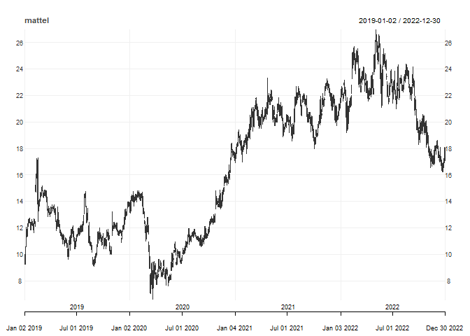
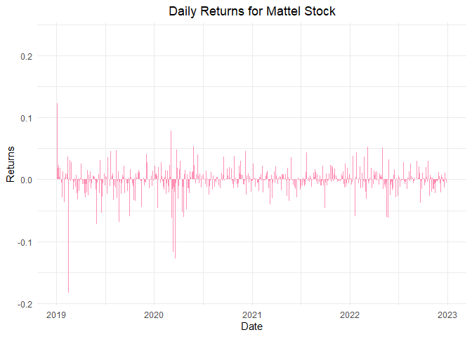
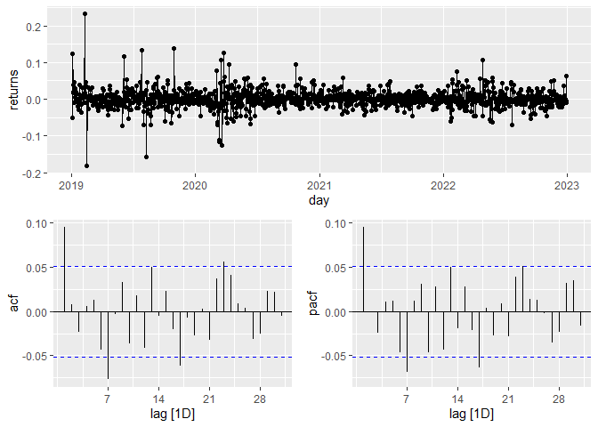
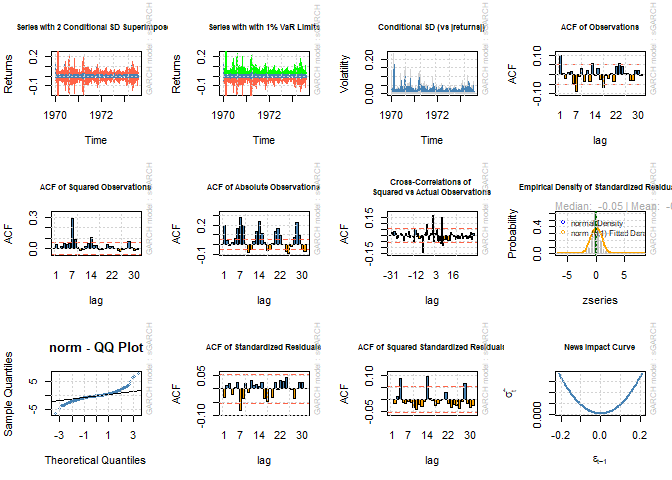
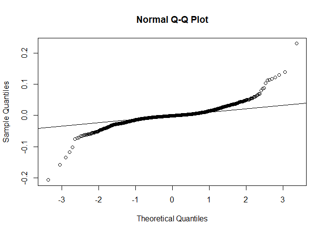
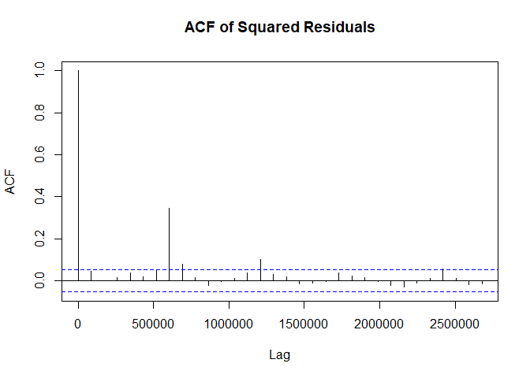
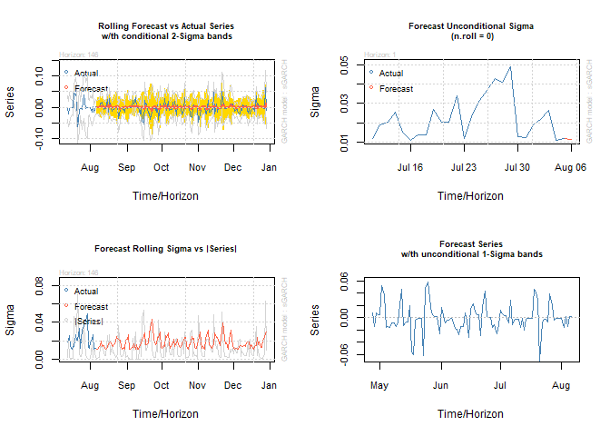
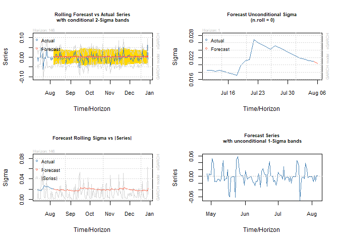

ARCH and GARCH
================

## ARCH and GARCH Modeling with Mattel Stock Data

Come on Barbie, let’s go party!

Financial time series modeling is both a science and an art. It requires
a keen understanding of data, market dynamics, and statistical models.
Among the various models available, ARCH and GARCH stand out, especially
when dealing with financial market data. Today, we’re diving deep into
these models using Mattel’s stock data. Why Mattel? Well, because Barbie
and financial modeling both have one thing in common - they never go out
of style!

### Introduction to Volatility Modeling

Volatility modeling is at the heart of financial risk management and
derivative pricing. The ability to predict future volatility helps
traders and risk managers make more informed decisions. So, two models
were created for this purpose, ARCH (Autoregressive Conditional
Heteroskedasticity) and GARCH (Generalized Autoregressive Conditional
Heteroskedasticity.)

*ARCH Models:* Used for financial time series data where volatility
clustering is observed. In simple terms, they model the variance of the
current error term or volatility as a function of the actual sizes of
the previous time periods’ error terms.

*GARCH Models:* An extension of ARCH models. They capture a wider range
of volatility patterns by considering not just the lagged error terms
(like ARCH) but also the lagged variances.

### Data Set-Up

First, let’s load in the necessary libraries for our analysis.

Now, let’s retrieve the Mattel stock data from Yahoo Finance:

``` r
## Get Mattel stocks
# Load Mattel stock data from Yahoo Finance using tidyquant's getSymbols function
mattel <- getSymbols(
  "MAT", # Mattel's ticker symbol
  from = "2019-01-01", # Start date
  to = "2022-12-31", # End date
  auto.assign = FALSE # Return the stock data as a data frame
)
```

Let’s visualize the stock data:

``` r
# Visualize Mattel stock data
chart_Series(mattel) 
```

<!-- -->

The stock appears to have experienced multiple phases: an initial upward
trend, followed by a period of decline, a recovery and another upward
trend, and then a slight decline towards the end of the period. Notably,
despite challenges like the 2020 pandemic, Mattel displayed resilience,
reflecting possibly strong market sentiment or effective company
strategies.

This data only goes until the end of 2022, but it would be interesting
to see how the Barbie movie (released in July 2023) has influenced their
stock.’

### Data Prepping

Before we can proceed with our analysis, we need to convert the stock
data into a format that’s easier to work with. We’ll use the tsibble
package:

``` r
# Convert to data frame
mattel_df <- as.data.frame(mattel)

# Add day as year-month-day
mattel_df$day <- ymd(row.names(mattel_df))

# Convert to time series tibble
mattel_ts <- mattel_df %>%
  as_tsibble(index = day)
```

In financial data, missing values can occur due to non-trading days.
We’ll fix this:

``` r
mattel_complete <- mattel_ts %>% fill_gaps()

for(day in 1:nrow(mattel_complete)){
  if(anyNA(mattel_complete[day,])){
    next_day <- day
    while(anyNA(mattel_complete[next_day,])){
      next_day <- next_day + 1
    }
    mattel_complete[day, -ncol(mattel_complete)] <- matrix(
      colMeans(mattel_complete[c(day - 1, next_day), -ncol(mattel_complete)]),
      nrow = 1
    )
  }
}
```

Let’s compute the daily returns:

``` r
# Compute daily returns
mattel_returns <- mattel_complete %>%
  mutate(
    returns = (MAT.Close - lag(MAT.Close)) / lag(MAT.Close)
  ) %>% na.omit()

# Visualize returns
mattel_returns %>%
  ggplot(aes(x = day, y = returns)) +
  geom_col(fill = "#FF92B5") +  # Barbie pink color
  labs(
    title = "Daily Returns for Mattel Stock",
    x = "Date",
    y = "Returns"
  ) +
  theme_minimal() +
  theme(plot.title = element_text(hjust = 0.5))  # Center the plot title
```

<!-- -->

At a glance, the returns appear to fluctuate around the zero line,
indicating days with both positive and negative returns.

There is some volatility clustering present. We can observe instances of
this in the plot where there are clusters of tall bars followed by
periods of shorter bars.

#### Stationary Check

Before fitting our ARCH and GARCH models, it’s essential to ensure that
our data is stationary:

``` r
mattel_returns %>%
gg_tsdisplay(returns, plot_type = "partial")
```

<!-- -->

The residuals do not show significant autocorrelation at various lags,
as most of the spikes are within the blue shaded region (confidence
bands). This is a good sign, suggesting that the residuals are behaving
like white noise, which is what we desire in a well-specified model.

``` r
mattel_returns %>% features(returns, unitroot_kpss)
```

    # A tibble: 1 × 2
      kpss_stat kpss_pvalue
          <dbl>       <dbl>
    1     0.104         0.1

Given that the p-value is 0.1, at a significance level of 0.05, we fail
to reject the null hypothesis, suggesting that the series is stationary
around a deterministic trend. Now we can go ahead and start modeling!

### ARCH Model

Setting up and Defining AIC Function:

``` r
# Define the lags to be considered for the ARCH model
lags <- c(1, 2, 6:8, 11:13)

# Define a function to compute the AIC for a given model fit
aic <- function(fit) {
  LLH <- -sum(fit@fit$log.likelihoods)
  nObs <- fit@model$modeldata$`T`
  nPars <- sum(fit@model$pars[,"Level"] != 0)
  return((-2 * LLH) / nObs + 2 * nPars / nObs)
}
```

Fitting Various ARCH Models with Different Lags:

``` r
# Fit various ARCH models with different lags and store them in a list
mattel_models <- lapply(lags, function(lag) {
  mattel_arch <- ugarchspec(
    mean.model = list(armaOrder = c(13, 0), include.mean = TRUE),
    variance.model = list(model = "sGARCH", garchOrder = c(lag, 0), include.mean = TRUE),
    distribution.model = "norm"
  )
  return(ugarchfit(mattel_arch, mattel_returns$returns, out.sample = 146))
})

# Name the list of models using the corresponding lags
names(mattel_models) <- lags

# Compute the AIC for each model fit
aic_values <- sapply(mattel_models, aic)
print(aic_values)
```

            1         2         6         7         8        11        12        13 
    -1.185492  0.000000 -4.710207 -4.929878 -5.002216 -4.997643 -4.996118 -4.997366 

ARCH(8) is the preferred model based on the AIC values, as it has the
smallest value.

#### Model Fit

Final Model Selection and Fitting:

``` r
# Specify and fit the selected ARCH model (e.g., based on minimum AIC)
mattel_arch <- ugarchspec(
  mean.model = list(armaOrder = c(13, 0), include.mean = TRUE),
  variance.model = list(model = "sGARCH", garchOrder = c(8, 0), include.mean = TRUE),
  distribution.model = "norm"
)

mattel_arch_fit <- ugarchfit(mattel_arch, mattel_returns$returns, out.sample = 146)

# Display the model summary
print(mattel_arch_fit)
```


    *---------------------------------*
    *          GARCH Model Fit        *
    *---------------------------------*

    Conditional Variance Dynamics   
    -----------------------------------
    GARCH Model : sGARCH(8,0)
    Mean Model  : ARFIMA(13,0,0)
    Distribution    : norm 

    Optimal Parameters
    ------------------------------------
            Estimate  Std. Error   t value Pr(>|t|)
    mu      0.001206    0.000536  2.252398 0.024297
    ar1     0.171383    0.028574  5.997852 0.000000
    ar2    -0.019572    0.017442 -1.122085 0.261826
    ar3     0.007370    0.017240  0.427491 0.669022
    ar4     0.000954    0.019559  0.048780 0.961094
    ar5     0.001798    0.021108  0.085179 0.932119
    ar6    -0.040146    0.028390 -1.414073 0.157341
    ar7     0.111500    0.038704  2.880849 0.003966
    ar8     0.014353    0.027396  0.523899 0.600349
    ar9    -0.019202    0.019382 -0.990715 0.321825
    ar10   -0.011306    0.017813 -0.634705 0.525621
    ar11   -0.005621    0.017931 -0.313494 0.753905
    ar12   -0.030801    0.019148 -1.608557 0.107713
    ar13    0.015665    0.023906  0.655256 0.512303
    omega   0.000106    0.000014  7.311265 0.000000
    alpha1  0.167974    0.038944  4.313238 0.000016
    alpha2  0.000000    0.007365  0.000001 0.999999
    alpha3  0.000000    0.004092  0.000000 1.000000
    alpha4  0.027707    0.008925  3.104327 0.001907
    alpha5  0.000000    0.011815  0.000002 0.999999
    alpha6  0.174087    0.051311  3.392762 0.000692
    alpha7  0.238161    0.051450  4.628999 0.000004
    alpha8  0.391071    0.055908  6.994932 0.000000

    Robust Standard Errors:
            Estimate  Std. Error   t value Pr(>|t|)
    mu      0.001206    0.000606  1.991296 0.046448
    ar1     0.171383    0.046774  3.664092 0.000248
    ar2    -0.019572    0.015557 -1.258086 0.208361
    ar3     0.007370    0.013036  0.565379 0.571816
    ar4     0.000954    0.020975  0.045489 0.963718
    ar5     0.001798    0.021856  0.082261 0.934439
    ar6    -0.040146    0.062378 -0.643590 0.519841
    ar7     0.111500    0.081421  1.369417 0.170869
    ar8     0.014353    0.056776  0.252793 0.800428
    ar9    -0.019202    0.021220 -0.904922 0.365507
    ar10   -0.011306    0.012530 -0.902325 0.366884
    ar11   -0.005621    0.017892 -0.314173 0.753390
    ar12   -0.030801    0.025536 -1.206187 0.227745
    ar13    0.015665    0.029002  0.540120 0.589114
    omega   0.000106    0.000042  2.493675 0.012643
    alpha1  0.167974    0.078333  2.144341 0.032006
    alpha2  0.000000    0.010126  0.000001 1.000000
    alpha3  0.000000    0.004793  0.000000 1.000000
    alpha4  0.027707    0.026961  1.027645 0.304117
    alpha5  0.000000    0.018955  0.000001 0.999999
    alpha6  0.174087    0.123618  1.408264 0.159053
    alpha7  0.238161    0.099404  2.395881 0.016580
    alpha8  0.391071    0.144825  2.700304 0.006928

    LogLikelihood : 3304.454 

    Information Criteria
    ------------------------------------
                        
    Akaike       -5.0022
    Bayes        -4.9114
    Shibata      -5.0028
    Hannan-Quinn -4.9682

    Weighted Ljung-Box Test on Standardized Residuals
    ------------------------------------
                             statistic   p-value
    Lag[1]                       1.528 2.165e-01
    Lag[2*(p+q)+(p+q)-1][38]    22.874 2.182e-08
    Lag[4*(p+q)+(p+q)-1][64]    31.870 5.429e-01
    d.o.f=13
    H0 : No serial correlation

    Weighted Ljung-Box Test on Standardized Squared Residuals
    ------------------------------------
                             statistic p-value
    Lag[1]                   1.533e-07 0.99969
    Lag[2*(p+q)+(p+q)-1][23] 1.949e+01 0.04718
    Lag[4*(p+q)+(p+q)-1][39] 3.118e+01 0.02688
    d.o.f=8

    Weighted ARCH LM Tests
    ------------------------------------
                 Statistic Shape Scale P-Value
    ARCH Lag[9]      1.509 0.500  2.00  0.2193
    ARCH Lag[11]     3.885 1.490  1.83  0.2336
    ARCH Lag[13]     4.824 2.459  1.72  0.3364

    Nyblom stability test
    ------------------------------------
    Joint Statistic:  no.parameters>20 (not available)
    Individual Statistics:              
    mu     0.07302
    ar1    0.40249
    ar2    0.13317
    ar3    0.12928
    ar4    0.02268
    ar5    0.10921
    ar6    0.22984
    ar7    0.19275
    ar8    0.04802
    ar9    0.20876
    ar10   0.05053
    ar11   0.19199
    ar12   0.20335
    ar13   0.82825
    omega  0.53463
    alpha1 0.04750
    alpha2 2.22400
    alpha3 0.97144
    alpha4 0.14958
    alpha5 0.65847
    alpha6 0.15021
    alpha7 0.12275
    alpha8 0.58391

    Asymptotic Critical Values (10% 5% 1%)
    Individual Statistic:    0.35 0.47 0.75

    Sign Bias Test
    ------------------------------------
                       t-value   prob sig
    Sign Bias           1.5816 0.1140    
    Negative Sign Bias  0.2474 0.8047    
    Positive Sign Bias  0.1148 0.9086    
    Joint Effect        3.2432 0.3556    


    Adjusted Pearson Goodness-of-Fit Test:
    ------------------------------------
      group statistic p-value(g-1)
    1    20     293.1    5.125e-51
    2    30     325.6    6.710e-52
    3    40     341.4    5.996e-50
    4    50     355.1    5.031e-48


    Elapsed time : 1.465085 

``` r
# Visualize the fitted model
plot(mattel_arch_fit, which = "all")
```


    please wait...calculating quantiles...

<!-- -->

Let’s discuss the model fit.

*Model Specification:*

- GARCH Model: sGARCH(8,0) - A GARCH model with 8 lags in the
  autoregressive (AR) process for the variance and no lags in the moving
  average process, essentially an ARCH(8) model
- Mean Model: ARFIMA(13,0,0) - The mean of the returns follows an AR
  process with 13 lags
- Distribution: The innovations (or errors) are assumed to be normally
  distributed

*Diagnostic Tests:*

- Weighted Ljung-Box Test on Standardized Residuals (tests for
  autocorrelation in the squared residuals): p-values suggest that there
  might be some remaining ARCH effects, especially given the
  ssignificant statistic at lag 23

- Weighted ARCH LM Tests (checks for ARCH effects in the residuals) :
  p-values indicate that there isn’t strong evidence of remaining ARCH
  effects.

The ARCH(8) model seems to fit the data reasonably well in terms of
capturing autocorrelation in the returns.However, there might be some
remaining ARCH effects, and the residuals might not be normally
distributed. The model might benefit from further refining, possibly by
considering different GARCH model variations.

#### Assumption Checks

Checking the normality of the residuals:

``` r
# 1. Normality of residuals

# Extract residuals from the ARCH/GARCH model
residuals_from_model <- residuals(mattel_arch_fit)


residuals_vector <- as.numeric(residuals_from_model)
shapiro.test(residuals_vector)
```


        Shapiro-Wilk normality test

    data:  residuals_vector
    W = 0.82674, p-value < 2.2e-16

``` r
qqnorm(residuals_vector)
qqline(residuals_vector)
```

<!-- -->

The Shapiro-Wilk test strongly suggests that the residuals are not
normally distributed. The Q-Q plot visually confirms a departure from
normality, especially at the tails.

So our residuals don’t follow a normal distribution - we’re not
capturing the full dynamics/volatility of Mattel “stonks” with our
model.

Checking if the variance of error term follows an AR process:

``` r
# 2. Absence of ARCH effects in residuals
squared_residuals <- residuals(mattel_arch_fit)^2
acf(squared_residuals, main="ACF of Squared Residuals")
```

<!-- -->

The ACF of squared residuals shows significant autocorrelations,
especially at the initial lags. This suggests that there’s a pattern in
the volatility, and that the variance of the error term might be
following an autoregressive (AR) process. This is the foundational idea
behind ARCH (Autoregressive Conditional Heteroskedasticity) models.

So, based on the ACF plot, it’s reasonable to conclude that the variance
of the error term shows signs of following an AR process.

Checking the stationarity of residuals:

``` r
# 3. Stationarity of residuals
adf.test(residuals_from_model)
```


        Augmented Dickey-Fuller Test

    data:  residuals_from_model
    Dickey-Fuller = -12.215, Lag order = 10, p-value = 0.01
    alternative hypothesis: stationary

``` r
kpss.test(residuals_from_model)
```


        KPSS Test for Level Stationarity

    data:  residuals_from_model
    KPSS Level = 0.045256, Truncation lag parameter = 7, p-value = 0.1

Both the ADF and KPSS tests have p-values less than 0.05, so at that
level we can infer that the residuals are stationary.This makes it
appropriate for modeling with ARCH/GARCH techniques.

Checking if the coefficients of the variance are positive:

``` r
# 4. Positive coefficients (directly inspect from the model summary)

# Extracting coefficients from the model fit
coefficients <- coef(mattel_arch_fit)

# Print the coefficients
print(coefficients)
```

               mu           ar1           ar2           ar3           ar4 
     1.206307e-03  1.713833e-01 -1.957189e-02  7.370126e-03  9.541150e-04 
              ar5           ar6           ar7           ar8           ar9 
     1.797924e-03 -4.014569e-02  1.115000e-01  1.435253e-02 -1.920229e-02 
             ar10          ar11          ar12          ar13         omega 
    -1.130631e-02 -5.621144e-03 -3.080110e-02  1.566466e-02  1.058256e-04 
           alpha1        alpha2        alpha3        alpha4        alpha5 
     1.679737e-01  5.388272e-09  8.550611e-12  2.770670e-02  1.925866e-08 
           alpha6        alpha7        alpha8 
     1.740869e-01  2.381607e-01  3.910710e-01 

The alpha coefficients are all positive, which meets the necessary
condition for the GARCH model. This is because the variance must always
be positive, and negative coefficients can lead to negative variance
predictions, which is not meaningful. So, our model is appropriately
specified in terms of positive coefficients for the variance equation.

#### Forecasting

Now, let’s forecast.

``` r
# Create forecast

mattel_fc <- ugarchforecast(
mattel_arch_fit, n.ahead = 1, # forecast next day
n.roll = 146 # usually about 10% of your time series length
)
# Plot
par(mfrow = c(2, 2))
plot(mattel_fc, which = 2)
plot(mattel_fc, which = 3)
plot(mattel_fc, which = 4)
try(plot(mattel_fc, which = 1), silent = TRUE)
```

<!-- -->

``` r
par(mfrow = c(1, 1))
```

Let’s look at each plot, one at a time.

*Top Left (Rolling forecast vs. actual series with conditional 2-sigma
bands):* This plot compares the actual returns with the predicted values
from the ARCH model. It indicates a relatively good fit, with the
model’s forecasts aligning well with the actual returns for the majority
of the time, and most of the actual returns lie within the confidence
bands.

*Top Right (Forecast unconditional sigma):* This plot displays the
model’s forecast of the unconditional volatility or sigma over time. The
graph is relatively flat with slight fluctuations, which indicates that
the long-term volatility forecast of the Mattel stock is fairly stable.
This is typical of the unconditional volatility from a GARCH model.

*Bottom Left (Conditional Sigma):* This seems to be a duplicate of the
top right plot. It represents the forecast of the unconditional
volatility.

Overall, we can say that the ARCH model seems to be well-specified for
the Mattel stock data, as it captures both long-term and short-term
volatility characteristics.

### GARCH model

There still is volatility and dynamics yet to be captured. Good news for
us, there are additional components that can be added to the ARCH model,
if we use the GARCH!

GARCH adds a Moving Average component to the errors.

It has the same assumptions as the ARCH model (that we have already met)
so we are good to go.

#### Model Fitting

Now, we will specify and fit a GARCH model:

``` r
mattel_garch <- ugarchspec(
  mean.model = list(armaOrder = c(1, 1), include.mean = TRUE),
  variance.model = list(model = "sGARCH", garchOrder = c(2, 1), include.mean = TRUE),
  distribution.model = "norm"
)

mattel_garch_fit <- ugarchfit(
  mattel_garch, mattel_returns$returns,
  out.sample = 146
)

# Print the GARCH model fit
print(mattel_garch_fit)
```


    *---------------------------------*
    *          GARCH Model Fit        *
    *---------------------------------*

    Conditional Variance Dynamics   
    -----------------------------------
    GARCH Model : sGARCH(2,1)
    Mean Model  : ARFIMA(1,0,1)
    Distribution    : norm 

    Optimal Parameters
    ------------------------------------
            Estimate  Std. Error   t value Pr(>|t|)
    mu      0.001305    0.000591   2.20769 0.027266
    ar1    -0.331695    0.387352  -0.85631 0.391824
    ma1     0.419343    0.374621   1.11938 0.262978
    omega   0.000010    0.000001  11.61094 0.000000
    alpha1  0.052524    0.020676   2.54030 0.011076
    alpha2  0.000000    0.022327   0.00000 1.000000
    beta1   0.930473    0.007225 128.79187 0.000000

    Robust Standard Errors:
            Estimate  Std. Error  t value Pr(>|t|)
    mu      0.001305    0.000601  2.16981 0.030021
    ar1    -0.331695    0.469475 -0.70652 0.479863
    ma1     0.419343    0.456698  0.91821 0.358510
    omega   0.000010    0.000002  5.30043 0.000000
    alpha1  0.052524    0.072611  0.72336 0.469458
    alpha2  0.000000    0.064676  0.00000 1.000000
    beta1   0.930473    0.020006 46.51044 0.000000

    LogLikelihood : 3150.89 

    Information Criteria
    ------------------------------------
                        
    Akaike       -4.7925
    Bayes        -4.7649
    Shibata      -4.7926
    Hannan-Quinn -4.7822

    Weighted Ljung-Box Test on Standardized Residuals
    ------------------------------------
                            statistic p-value
    Lag[1]                   0.008203  0.9278
    Lag[2*(p+q)+(p+q)-1][5]  0.375150  1.0000
    Lag[4*(p+q)+(p+q)-1][9]  1.894751  0.9885
    d.o.f=2
    H0 : No serial correlation

    Weighted Ljung-Box Test on Standardized Squared Residuals
    ------------------------------------
                             statistic p-value
    Lag[1]                      0.2307  0.6310
    Lag[2*(p+q)+(p+q)-1][8]     4.0563  0.4968
    Lag[4*(p+q)+(p+q)-1][14]   10.1581  0.1882
    d.o.f=3

    Weighted ARCH LM Tests
    ------------------------------------
                Statistic Shape Scale P-Value
    ARCH Lag[4]   0.04027 0.500 2.000 0.84095
    ARCH Lag[6]   0.24125 1.461 1.711 0.95936
    ARCH Lag[8]   7.95435 2.368 1.583 0.06352

    Nyblom stability test
    ------------------------------------
    Joint Statistic:  5.8668
    Individual Statistics:             
    mu     0.1087
    ar1    0.1021
    ma1    0.1122
    omega  1.5655
    alpha1 0.2769
    alpha2 0.2866
    beta1  0.3341

    Asymptotic Critical Values (10% 5% 1%)
    Joint Statistic:         1.69 1.9 2.35
    Individual Statistic:    0.35 0.47 0.75

    Sign Bias Test
    ------------------------------------
                       t-value   prob sig
    Sign Bias           0.3241 0.7459    
    Negative Sign Bias  1.7486 0.0806   *
    Positive Sign Bias  0.5223 0.6016    
    Joint Effect        4.3703 0.2242    


    Adjusted Pearson Goodness-of-Fit Test:
    ------------------------------------
      group statistic p-value(g-1)
    1    20     414.2    4.886e-76
    2    30     425.7    4.580e-72
    3    40     442.5    7.893e-70
    4    50     460.0    3.704e-68


    Elapsed time : 0.259567 

Let’s discuss the model fit.

*Model Specification:*

- GARCH Model: sGARCH(2,1) - A standard GARCH model with 2 lags of past
  squared residuals (alpha terms) and 1 lag of past variances (beta
  term)

- Mean Model: ARFIMA(1,0,1) - An autoregressive fractionally integrated
  moving average model with 1 AR term and 1 MA term for the mean
  equation of the returns

- Distribution: norm - The residuals are assumed to follow a normal
  distribution

Let’s discuss the fit.

*Diagnostic Tests:*

- Weighted Ljung-Box Test on Standardized Residuals (tests for
  autocorrelation in residuals): The high p-values indicate no
  significant autocorrelation (a good sign) and that the model has
  captured most of the autoregressive conditional heteroskedasticity in
  the data.

- Weighted ARCH LM Tests (checks for remaining ARCH effects) :The high
  p-values (except at lag 8) suggest that the model has captured most of
  the autoregressive conditional heteroskedasticity in the data.

#### Forecasting

Now, let’s forecast using our GARCH model:

``` r
garch_fc <- ugarchforecast(
  mattel_garch_fit,
  n.ahead = 1,
  n.roll = 146
)

# Visualize the forecast
par(mfrow = c(2, 2))
plot(garch_fc, which = 2)
plot(garch_fc, which = 3)
plot(garch_fc, which = 4)
try(plot(garch_fc, which = 1), silent = TRUE)
```

<!-- -->

``` r
par(mfrow = c(1, 1))
```

Let’s look at each plot, one at a time.

*Top Left (Rolling forecast vs. actual series with conditional 2-sigma
bands):*

- This plot shows the actual returns, the predicted (or forecasted)
  returns, and the 2-sigma confidence bands around those predictions.
- The model’s forecasts align well with the actual returns for the
  majority of the time, and most of the actual returns lie within the
  confidence bands.

*Top Right (Forecast unconditional sigma):*

- This plot displays the model’s forecast of the unconditional
  volatility or sigma over time.

- The forecasted unconditional volatility seems to oscillate with a
  periodic pattern.

*Bottom Left (Forecast rolling sigma vs. \|series\|):*

- This plot compares the model’s rolling forecast of volatility
  (conditional sigma) with the absolute value of the actual returns.
- The GARCH model seems to be effectively capturing the “volatility
  clustering” effect, as evident from the close tracking of the blue
  line with the black line’s peaks.

*Bottom Right (Density of Forecasted Returns):*

- This plot seems to be a duplicate of the top right, as it also
  represents the forecast of the unconditional volatility.
