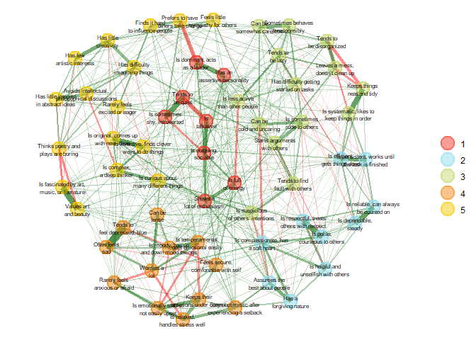
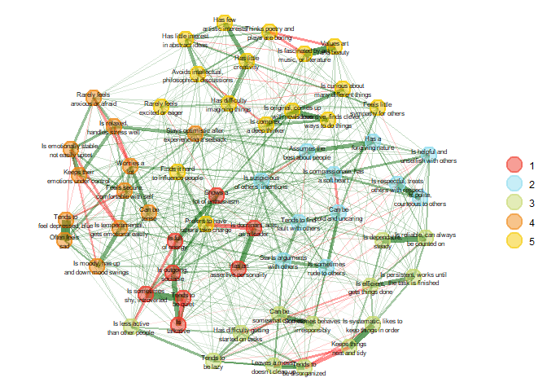
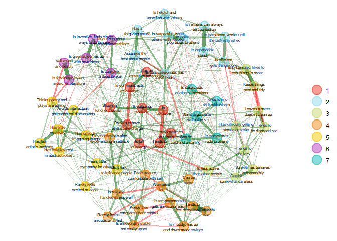
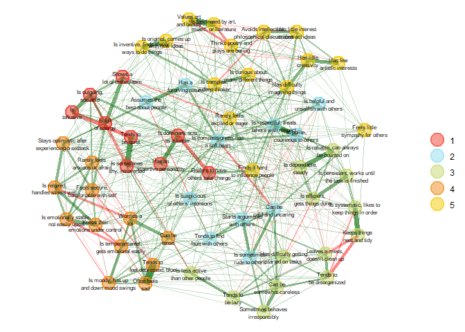
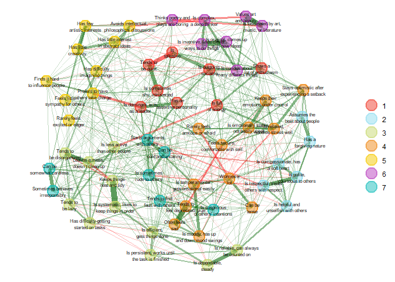
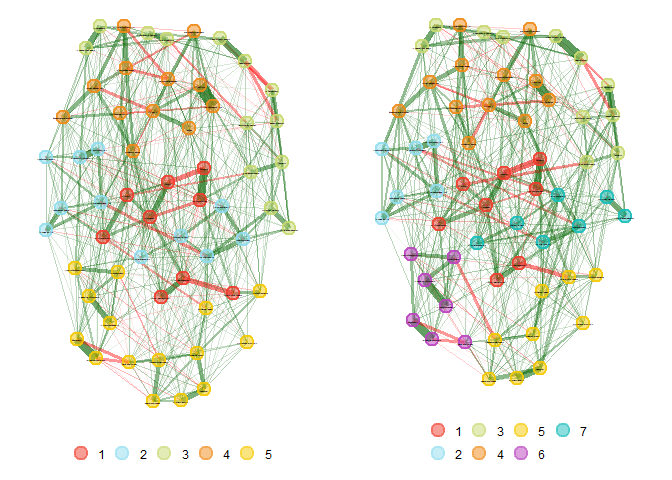
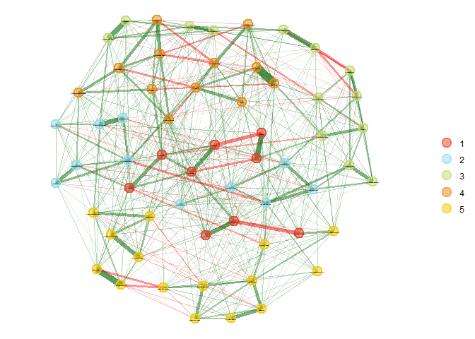
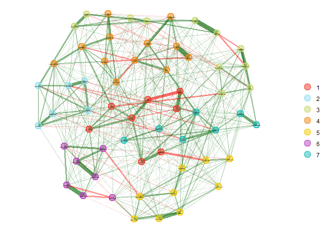

EGA
================

# Exploratory Graph Analysis (EGA) of the BFI-2 Dataset

In this assignment, we’ll delve into the BFI-2 dataset using the Big
Five personality theory. Our goal is to understand the structure of the
BFI-2 when analyzed using Exploratory Graph Analysis (EGA).

EGA offers a graphical approach to factor analysis. It’s aimed at
uncovering the underlying structure of data, specifically for
identifying the number of dimensions (or factors) in a set of variables.
This is particularly useful when working with pyschometrics and
psychological data, where understanding the underlying factors can offer
insights into human behavior and cognition.

*The general steps to perform exploratory graph analysis are:*

1.  Estimate associations (e.g., correlations)

2.  Estimate network (using an unsupervised learning algorithm)

3.  Apply a community detection algorithm

## Setting up the Environment

## Goal of Assignment

*Our goal is to answer these research questions:*

1.  What is the structure of the BFI-2 when analyzed using Exploratory
    Graph Analysis (EGA) across the entire sample at time 1?

2.  What algorithm, Walktrap or Louvain, appears to fit the data better?

3.  Does the best fitting EGA-identified structure fit better than the
    theoretical structure?

4.  When split into younger and middle-aged groups, do the dimensions
    *appear* to align?

## Loading and Pre-processing the Data

Let’s start by loading the data and the codebook:

``` r
# Load data
bfi2 <- read.csv("bfi-2_data.csv")

# Load codebook
bfi2_codebook <- readxl::read_excel("bfi-2_codebook.xlsx")

# Replace variable names with item descriptions
colnames(bfi2)[grepl("BFI", colnames(bfi2))] <- bfi2_codebook$item_description
```

## Data Summary

The data is derived from the Big Five Inventory 2 (BFI-2), which you can
find more about here: [BFI-2
Reference.](https://psycnet.apa.org/record/2016-17156-001?doi=1)

BFI-2 is built on the Big Five personality theory and consists of 60
items—12 for each trait. Each of these traits is further broken down
into 3 facets, each with 4 items. These facets aim to reflect specific
attributes of personality under the umbrella of broader traits. For a
detailed breakdown, you can refer to the `bfi-2_codebook.xlsx.`

The core traits of the Big Five, or the “Five Factor Model,” are:

- Openness to Experience (O)

- Conscientiousness (C)

- Extraversion (E)

- Agreeableness (A)

- Neuroticism (N)

The dataset at hand is sourced from the following study: [Study
Link.](https://osf.io/preprints/psyarxiv/bzkwd/)

For context on the sample used:

The study titled “LOOPRP” explored the replicability of the connections
between personality and outcomes (as discussed by Soto, 2019). From the
6,126 initial participants, they were categorized into two age groups:

- Ages 18 to 50 (with 1,662 participants having an average age of 35.09
  years)

- Ages 18 to 25 (with 3,459 participants, averaging at 21.89 years of
  age)

It’s worth noting that due to some age overlaps, the two groups have
shared participants.

## Analysis

### Dissecting BFI-2 at Time 1

First, we subset the BFI-2 data to focus solely on responses from the
first survey (Time 1).

``` r
# Subset the data to only include rows where CaseID contains "Survey1"
survey1_data <- bfi2 %>% 
  filter(str_detect(CaseID, "^Survey1")) %>%
  select(4:63) #don't want case id, age, sex in the exploratory graph analysis
```

``` r
# will use this later when need to filter with ages 
survey1_data_ages <- bfi2 %>% 
  filter(str_detect(CaseID, "^Survey1"))
```

Lets estimate the associations with a correlation matrix.

``` r
##create a correlation matrix
survey1_corr <- auto.correlate(survey1_data)
#survey1_corr  ## not printing for report, too long
```

### Comparing Walktrap and Louvain Algorithms

#### Applying EGA to Time 1 Data

In R, the EGA package provides the necessary tools to perform
exploratory graph analysis. The output from an EGA can then be
visualized as a network plot, highlighting the relationships between
variables and the detected dimensions.

``` r
survey1_ega<- EGA(survey1_data , node.size=6, label.size=2, plot.EGA = TRUE)
```

<!-- -->

``` r
#summary(survey1_ega) ## not printing for report, too long
```

The graphical output displays nodes (variables) connected by edges
(relationships). Nodes are grouped and colored based on their detected
communities, indicating variables that share strong relationships or
exhibit similar patterns. The thickness and color of the edges can
indicate the strength and direction of relationships.

#### Insights from EGA

- Number of Communities: There were 5 communities detected.

  - Community 1 strongly aligns with Extraversion (E)
  - Community 2 aligns with Agreeableness (A)
  - Community 3 seems related to Conscientiousness (C)
  - Community 4 aligns well with Neuroticism (N)
  - Community 5 aligns with Openness to Experience (O)

- Lambda: The lambda used was 0.08099

  - Lambda is a regularization parameter used in graphical LASSO. A
    higher lambda would produce a sparser graph (with fewer edges),
    whereas a smaller lambda would allow more edges. In this context,
    the chosen lambda has resulted in a graph with 562 edges out of a
    possible 60\*(60-1)/2 = 1953 potential edges. The lambda has
    effectively filtered out weaker or spurious connections but retained
    meaningful ones.

- Number of Edges: 562

  - This tells us the actual number of significant relationships or
    connections between the different nodes (items) in the graph. Given
    that there are 60 nodes, a total of 562 edges indicates that many
    items are interconnected, providing insights into the complex
    relationships between them.

- Edge Density: 0.318

  - A density of 0.318 means that roughly 30.8% of all possible
    connections between nodes are present. It’s a good balance,
    suggesting that the lambda parameter was appropriately set to
    capture meaningful relationships without including too many
    potentially weak or irrelevant ones.

- TEFI: The TEFI value was -75.523.

  - TEFI is an index to measure the goodness-of-fit of the graphical
    model. In this context, the negative value suggests there might be
    some degree of misfit, but the degree of concern would depend on
    comparisons with other models or established benchmarks.

#### Testing with the Louvain Algorithm

To validate our findings, we apply the Louvain algorithm to the same
dataset and compare the outcomes.

``` r
survey1_louvain<- EGA(survey1_data, algorithm = "louvain", node.size=6, label.size=2, plot.EGA = TRUE)
```

<!-- -->

``` r
#summary(survey1_louvain)  ## not printing for report, too long
```

- Number of Communities: There were 5 communities detected.

  - Community 1 strongly aligns with Extraversion (E)
  - Community 2 aligns with Agreeableness (A)
  - Community 3 seems related to Conscientiousness (C)
    - includes items like “Is dependable, steady,” which may suggest a
      more conventional representation of conscientious traits
  - Community 4 aligns well with Neuroticism (N)
  - Community 5 aligns with Openness to Experience (O)

- Lambda: The lambda used was 0.08099

  - This is the regularization parameter used in the graphical lasso
    (GLASSO) algorithm, which is part of the process to estimate the
    network. The lambda value affects the sparsity of the network, with
    higher values leading to fewer edges and a more sparse network.

- Number of Edges: 562

  - This is the count of significant connections (edges) between nodes
    (items) in your network. The higher number of edges might suggest
    complex interrelationships between the items in the survey.

- Edge Density: 0.318

  - Edge density is the proportion of actual edges present in the
    network out of all possible edges. An edge density of 0.318 means
    its dense enough to suggest meaningful connections but not so dense
    as to be confusing or indicative of noise.

- TEFI: The TEFI value was -74.933.

  - The TEFI score is a measure of the fit of the estimated network
    model to the data, with higher values (closer to 0) indicating a
    better fit. A TEFI of -74.933 suggests that there may be some
    discrepancies between the observed data and the model’s
    representation of that data.

#### Comparative Analysis of Algorithms

The Exploratory Graph Analysis (EGA) and the Louvain algorithm both
identified five communities within the survey data, that are similar.

In general, the Walktrap algorithm used in EGA tends to group items
based on local connectivity, leading to smaller communities, while the
Louvain method optimizes community structure for the entire network,
leading to more diverse communities that reflect broader connections.

Some differences between the community assignment we can see is:

- “Tends to find fault with others” is assigned to community 3 in EGA
  and community 2 in Louvain

- “Is reliable, can always be counted on” is assigned to community 2 in
  EGA and community 3 in Louvain

- “Starts arguments with others” is assigned to community 3 in EGA and
  community 2 in Louvain

I think that the Louvain fits the data better, as it aligns more closely
with the big 5 personality distinctions.

### Comparing EGA-identified structure fit to theoretical structure

#### Theoretical Big Five structure TEFI

The TEFI score is used to compare the fit of different network
structures or to assess how well a given network structure represents
the underlying factorial structure of the data. The model with the
highest TEFI score (i.e., the least negative) is considered to have the
best fit among the models being compared.

``` r
compare_tefi <- data.frame(
  Algorithm = c("EGA", "Louvain"),
  TEFI = c(survey1_ega$TEFI, survey1_louvain$TEFI) 
)
print(compare_tefi)
```

      Algorithm      TEFI
    1       EGA -75.52314
    2   Louvain -74.93304

#### Comparing theoretical to EGA structure

The TEFI score for the Louvain algorithm is less negative than the TEFI
score for the EGA, which suggests that the structure identified by the
Louvain algorithm has a better fit to the data than the one identified
by the EGA.

#### Visual Comparison

``` r
fit_walktrap <- EGA.fit(survey1_data, algorithm = "walktrap", node.size=6, label.size=2, plot.EGA = TRUE)
```

<!-- -->

``` r
fit_louvain <- EGA.fit(survey1_data, algorithm = "louvain", node.size=6, label.size=2, plot.EGA = TRUE)
```

<!-- -->

``` r
#summary(fit_walktrap)
#summary(fit_louvain)
## not printing for report, too long
```

The less negative TEFI score indicates a better fit; the Walktrap
algorithm (TEFI: -75.523) fits the data better than the Louvain
algorithm (TEFI: -82.32). Community wise, the Walktrap algorithm
suggests a structure with 5 communities, whereas the Louvain algorithm
suggests a structure with 7 communities.

Considering the theoretical structure to be represented by these
algorithms, the Walktrap algorithm shows an improvement in fit over the
Louvain algorithm. It has a better (less negative) TEFI score and a
network structure with fewer communities, which might be more
interpretable or aligned with the underlying theoretical constructs of
the Big Five personality traits.

### Age Group Analysis

#### Splitting Data by Age

We divide the Time 1 data into “younger” and “middle-aged” groups to
explore if and how personality trait structures differ with age.

``` r
survey1_data <- bfi2 %>% 
  filter(str_detect(CaseID, "^Survey1")) %>%
  select(4:63) #don't want case id, age, sex in the exploratory graph analysis
```

``` r
younger <- survey1_data_ages %>%
  filter(Age >= 18 & Age <= 25)

middle_aged <- survey1_data_ages %>%
  filter(Age > 25 & Age <= 50)
```

``` r
##now am taking out the "extra" rows of case id, age, sex
younger <- younger %>% 
  select(4:63) 

middle_aged <- middle_aged %>% 
  select(4:63) 
```

#### EGA for Different Age Groups

Employing the Louvain algorithm, we perform EGA for both age groups
separately, uncovering any differences in trait interrelations.

``` r
ega_younger <- EGA(younger, algorithm = "louvain",  node.size=6, label.size=2, plot.EGA = TRUE)
```

<!-- -->

``` r
ega_middle_aged <- EGA(middle_aged, algorithm = "louvain",  node.size=6, label.size=2, plot.EGA = TRUE)
```

<!-- -->

#### Visual Comparison

Using the compare.EGA.plots() function, we visually contrast the
findings between the younger and middle-aged groups, highlighting both
similarities and differences.

``` r
compare.EGA.plots(ega_younger, ega_middle_aged, node.size = 4, label.size = 0)
```

<!-- -->

    $all

<!-- -->


    $individual
    $individual$`1`

<!-- -->


    $individual$`2`

<!-- -->

``` r
#summary(ega_younger)
#summary(ega_middle_aged)
## not printing for report, too long
```

*Comparing the two:*

- Similarities:

  - Both have multiple communities (5 vs. 7) that reflect various
    underlying dimensions of personality

  - Similar edge density (0.318 for younger vs. 0.305 for middle-aged),
    indicating a fairly consistent level of overall connectivity among
    the traits within each age group

- Differences:

  - Number of communities differs (younger group having 5 and the
    middle-aged group having 7) suggesting a possible diversification of
    trait interrelations with age

    - middle-aged group’s data could be indicative of the cumulative
      effects of life experiences on personality traits

  - TEFI scores indicate that the network model fits the younger group’s
    data better than the middle-aged group’s data (-73.648 vs. -79.747).

Overall, the EGA using the Louvain algorithm suggests a better fit for
the younger group compared to the middle-aged group, with fewer
identified communities.

### Conclusion

In examining the BFI-2 using Exploratory Graph Analysis (EGA), the study
identified a complex structure of personality traits. The Louvain
algorithm proved to have a better fit for the data in comparison to the
Walktrap algorithm, as indicated by the TEFI scores. Despite this, the
theoretical structure still held up more robustly than the
EGA-identified structure. When the data was divided into younger and
middle-aged groups, the resulting structures differed, with the younger
group presenting a five-community model and the middle-aged group a
seven-community model, suggesting developmental variances in personality
trait configurations across the lifespan. The research questions have
been addressed, providing insight into the layered nature of personality
traits and their potential evolution with age.
