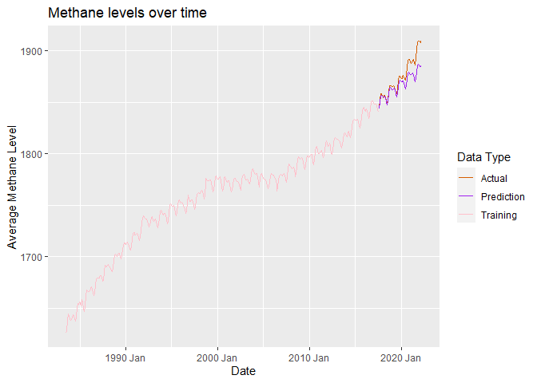

Assignment 3
================
Rachel Montgomery
2023-09-18

# FPP3 8.8 Exercises: 5(a-e)

## Fit and Forecast Methane Data using ETS

Data set `global_economy` contains the annual Exports from many
countries. Select one country to analyze.

### a. Plot the Exports series and discuss the main features of the data.

``` r
# ?global_economy
# 
# view(global_economy) ## commenting so knitted output isn't as long 
glimpse(global_economy)
```

    ## Rows: 15,150
    ## Columns: 9
    ## Key: Country [263]
    ## $ Country    <fct> "Afghanistan", "Afghanistan", "Afghanistan", "Afghanistan",…
    ## $ Code       <fct> AFG, AFG, AFG, AFG, AFG, AFG, AFG, AFG, AFG, AFG, AFG, AFG,…
    ## $ Year       <dbl> 1960, 1961, 1962, 1963, 1964, 1965, 1966, 1967, 1968, 1969,…
    ## $ GDP        <dbl> 537777811, 548888896, 546666678, 751111191, 800000044, 1006…
    ## $ Growth     <dbl> NA, NA, NA, NA, NA, NA, NA, NA, NA, NA, NA, NA, NA, NA, NA,…
    ## $ CPI        <dbl> NA, NA, NA, NA, NA, NA, NA, NA, NA, NA, NA, NA, NA, NA, NA,…
    ## $ Imports    <dbl> 7.024793, 8.097166, 9.349593, 16.863910, 18.055555, 21.4128…
    ## $ Exports    <dbl> 4.132233, 4.453443, 4.878051, 9.171601, 8.888893, 11.258279…
    ## $ Population <dbl> 8996351, 9166764, 9345868, 9533954, 9731361, 9938414, 10152…

``` r
#Filter for Exports for one country
global_economy %>% 
    filter(Country == 'Switzerland') -> switz_econ  
## I picked Switzerland b/c I traveled there last year (Geneva, Mt. Blanc) and absolutely loved it!

# Convert to `tsibble`
switz_econ <- as_tsibble(switz_econ,index=Year) #making into tibble so can plots

#subset further for training data - 2/3 of data is at 1998 so thats training, that onwards will be testing
switz_econ %>%
    filter(Year <= year(as.Date("1998-01-01"))) -> switz_train

switz_train <- as_tsibble(switz_train, index=Year)

#visualize the subset
switz_econ %>%
  autoplot(Exports) +
  labs(y = "Exports", title = "Switzerland Exports")
```

<!-- -->

Overall, there is an upward trend of the data. There is missing data for
the 70s, which I’ll attribute to missing data points.

There are several low points, which mostly can be explained by economic
recessions. - Switzerland’s economy was marred by slow growth in the
1990s, having the weakest economic growth in Western Europe. The economy
was affected by a three-year recession from 1991 to 1993 - However,
beginning in 1997, a global resurgence in currency movement provided the
necessary stimulus to the Swiss economy. - There is a dip after 2000,
because of the worldwide stock market crashes in the wake of the 9/11
terrorist attacks, - The stock market collapse of 2007-2009 deeply
affected investment income earned abroad.

Overall, the economic history of Switzerland shows the long-term
transition from a poor rural economy to a world leader in finance with a
very high standard of living. By 1900 it had become one of the
wealthiest nations in Europe in terms of GDP.

**(All of this research is from Wikipedia.)**

### b. Use an ETS(A,N,N) model to forecast the series, and plot the forecasts.

``` r
#ETS (AAN) model 
switz_train$Exports %>%
    ets(model = "AAN")  %>% 
    forecast(h = 2) -> switz_holt

#RMSE
sqrt(mean(switz_holt$residuals^2))
```

    [1] 2.530817

``` r
#ETS(A,A,N) Holt model:
switz_holt %>% autoplot()
```

<!-- -->

### c. Compute the RMSE values for the training data.

``` r
switz_train$Exports %>%
    ets(model = "ANN") %>% 
    forecast(h = 2) -> switz_ses

#calculate corresponding RMSE
sqrt(mean(switz_ses$residuals^2))
```

    [1] 2.510073

### d. Compare the results to those from an ETS(A,A,N) model. (Remember that the trended model is using one more parameter than the simpler model.) Discuss the merits of the two forecasting methods for this data set.

``` r
# Calculate RMSE for ETS(AAN) Model
rmse_aan <- sqrt(mean(switz_holt$residuals^2))

# Calculate RMSE for ETS(ANN) Model
rmse_ann <- sqrt(mean(switz_ses$residuals^2))

# Compare RMSE values
cat("RMSE for ETS(AAN) Model:", rmse_aan, "\n")
```

    RMSE for ETS(AAN) Model: 2.530817 

``` r
cat("RMSE for ETS(ANN) Model:", rmse_ann, "\n")
```

    RMSE for ETS(ANN) Model: 2.510073 

Merits of ETS(AAN) Model (Trended Model):

- Useful for forecasting when there is evidence of a long-term growth or
  decline in the variable of interest.

- It provides more flexibility in handling complex time series data with
  both seasonality and trend components.

Merits of ETS(ANN) Model (Non-Trended Model):

- Simplicity: This model is simpler with fewer parameters, which can
  make it easier to estimate and interpret.

- Suitable for datasets that do not exhibit a clear, long-term trend or
  where the trend is not of primary interest.

For this dataset, I believe that the ETS(ANN) model (trended model) is a
better fit. This type of model can capture both the seasonality and the
underlying trend in the data, which can be valuable because this dataset
exhibits noticeable trend patterns over time.

> Discuss which model has better fit and whether the more complex model
> is necessary

### e. Compare the forecasts from both methods. Which do you think is best?

``` r
# ETS(AAN) Model (Trended Model)
switz_train %>%
  model(ETS = ETS(Exports ~ error("A") + trend("A") + season("N"))) %>%
  forecast(h = 39) -> switz_holt

# ETS(ANN) Model (Non-Trended Model)
switz_train %>%
  model(ETS = ETS(Exports ~ error("A") + season("N"))) %>%
  forecast(h = 39) -> switz_ses

# Plot the actual data and forecasts from both methods

switz_train %>%
  autoplot(Exports) +
  labs(y = "Exports", title = "Comparison of Actual Data and Forecasts") +
  autolayer(switz_holt, series = "ETS(AAN) Forecast", PI = FALSE) +
  autolayer(switz_ses, series = "ETS(ANN) Forecast", PI = FALSE) +
  scale_color_manual(values = c("blue", "red", "green")) +
  theme(legend.position = "bottom")
```

<!-- -->

Because both forecasting models have similar RMSE values, it suggests
that both models are providing approximately equally accurate forecasts
for this dataset. I’ll choose the ETS(ANN) model (trended model) because
it can better capture trends.

### Fit `ETS` so it finds the best fitting model (get fit statistics the fit)

``` r
# Fit ETS models and select the best one
best_ets_model <- ets(switz_train$Exports, ic = "bic")

# Print the best-fitting ETS model
summary(best_ets_model)
```

    ETS(M,N,N) 

    Call:
     ets(y = switz_train$Exports, ic = "bic") 

      Smoothing parameters:
        alpha = 0.9999 

      Initial states:
        l = 47.0596 

      sigma:  0.0595

         AIC     AICc      BIC 
    96.52882 98.12882 99.36214 

    Training set error measures:
                          ME     RMSE      MAE        MPE     MAPE      MASE
    Training set -0.01883127 2.510635 1.928044 -0.1948215 4.306336 0.9510363
                        ACF1
    Training set 0.008134945

### Use the best fitting model to forecast 10 time points out

``` r
# Forecast 10 time points ahead using the best-fitting ETS model
forecast_horizon <- 10
forecasts <- forecast(best_ets_model, h = forecast_horizon)

# Print the forecasts
print(forecasts)
```

    ##    Point Forecast    Lo 80    Hi 80    Lo 95    Hi 95
    ## 40       46.70186 43.13817 50.26555 41.25166 52.15206
    ## 41       46.70186 41.65783 51.74590 38.98767 54.41605
    ## 42       46.70186 40.51883 52.88489 37.24573 56.15799
    ## 43       46.70186 39.55604 53.84768 35.77327 57.63045
    ## 44       46.70186 38.70554 54.69818 34.47255 58.93117
    ## 45       46.70186 37.93459 55.46914 33.29347 60.11025
    ## 46       46.70186 37.22373 56.17999 32.20631 61.19741
    ## 47       46.70186 36.56033 56.84340 31.19172 62.21200
    ## 48       46.70186 35.93559 57.46814 30.23626 63.16746
    ## 49       46.70186 35.34312 58.06060 29.33017 64.07355

``` r
# Plot the forecasts
autoplot(forecasts) +
  labs(y = "Exports", title = "ETS Model Forecast")
```

<!-- -->

### `report` the model and interpret each smoothing parameter

``` r
# Print the best-fitting ETS model
summary(best_ets_model)
```

    ## ETS(M,N,N) 
    ## 
    ## Call:
    ##  ets(y = switz_train$Exports, ic = "bic") 
    ## 
    ##   Smoothing parameters:
    ##     alpha = 0.9999 
    ## 
    ##   Initial states:
    ##     l = 47.0596 
    ## 
    ##   sigma:  0.0595
    ## 
    ##      AIC     AICc      BIC 
    ## 96.52882 98.12882 99.36214 
    ## 
    ## Training set error measures:
    ##                       ME     RMSE      MAE        MPE     MAPE      MASE
    ## Training set -0.01883127 2.510635 1.928044 -0.1948215 4.306336 0.9510363
    ##                     ACF1
    ## Training set 0.008134945

> Interpret the parameters

- Alpha (α): 0.9999

  - Alpha is very close to 1, which indicates that the model assigns
    nearly all the weight to the most recent observation when making
    predictions. This means that the model relies heavily on the most
    recent data point and has little memory of past observations. It
    suggests very strong exponential smoothing in the model. Initial
    States:

- Initial Level (l): 47.0596

  - The initial level represents the estimated starting point for the
    series. In this case, it’s approximately 47.0596, indicating that
    the model’s initial estimate for the level of the time series is
    around this value. Sigma (σ):

- Sigma (σ): 0.0595

  - Sigma represents the estimated standard deviation of the error term
    in the model. A smaller sigma value suggests that the model’s
    predictions are expected to be close to the actual values. In this
    case, a value of 0.0595 indicates that the model expects relatively
    low variability in the errors.

Overall, the ETS(M,N,N) model with the given smoothing parameters
suggests that it places very high emphasis on the most recent data point
when making predictions (high alpha), does not incorporate a trend
component (N for “None”), and does not incorporate a seasonal component
(N for “None”).

## Fit and Forecast Methane Data using ETS

Use the globally averaged marine surface methane data from NOAA. Here’s
the website where the data can be found: <https://gml.noaa.gov/ccgg/>

### Prepare Data

``` r
methane <- read_csv("methane_data_real.csv")

## make date the year and month 
methane <- methane %>%
  mutate(Date = yearmonth(paste(year, month, sep = "-")))
```

note: CH4 expressed as a mole fraction in dry air, nanomol/mol,
abbreviated as ppb

### Set Prediction and Actual Data

- Create an object called `prediction_methane` with the dates from July
  1983-July 2017

- Create a separate object called `actual_methane` with the dates from
  August 2017-April 2022

``` r
# Filter for prediction_methane (July 1983 to July 2017)
prediction_methane <- methane %>%
  filter(Date >= yearmonth("1983-07") & Date <= yearmonth("2017-07"))

# Filter for actual_methane (August 2017 to April 2022)
actual_methane <- methane %>%
  filter(Date >= yearmonth("2017-08") & Date <= yearmonth("2022-04"))

# Convert to tsibble so we can use it in this notebook
prediction_methane <- as_tsibble(prediction_methane, index = Date)
actual_methane <- as_tsibble(actual_methane, index = Date)

# Print the first few rows of prediction_methane and actual_methane
print("prediction_methane:")
```

    [1] "prediction_methane:"

``` r
head(prediction_methane)
```

    # A tsibble: 6 x 8 [1M]
       year month decimal average average_unc trend trend_unc     Date
      <dbl> <dbl>   <dbl>   <dbl>       <dbl> <dbl>     <dbl>    <mth>
    1  1983     7   1984.   1626.         2.1 1636.       1.4 1983 Jul
    2  1983     8   1984.   1628          2.7 1636.       1.3 1983 Aug
    3  1983     9   1984.   1638.         2.3 1637.       1.3 1983 Sep
    4  1983    10   1984.   1645.         1.6 1637.       1.2 1983 Oct
    5  1983    11   1984.   1643.         0.8 1638.       1.1 1983 Nov
    6  1983    12   1984.   1640.         1   1638.       1   1983 Dec

``` r
print("actual_methane:")
```

    [1] "actual_methane:"

``` r
head(actual_methane)
```

    # A tsibble: 6 x 8 [1M]
       year month decimal average average_unc trend trend_unc     Date
      <dbl> <dbl>   <dbl>   <dbl>       <dbl> <dbl>     <dbl>    <mth>
    1  2017     8   2018.   1845.         1.2 1850.       0.6 2017 Aug
    2  2017     9   2018.   1853.         1   1851.       0.6 2017 Sep
    3  2017    10   2018.   1858.         1   1852.       0.6 2017 Oct
    4  2017    11   2018.   1859.         0.8 1852.       0.7 2017 Nov
    5  2017    12   2018.   1857.         0.9 1853.       0.7 2017 Dec
    6  2018     1   2018.   1854.         1   1854.       0.7 2018 Jan

### Plot the Time Series for `prediction_methane`

``` r
# Create a time series plot for prediction_methane

prediction_methane %>%
  autoplot(average) +
  ggtitle("Average Methane Prediction") +
  xlab("Date") +
  ylab("Average Methane Value")
```

<!-- -->

### Fit Best ETS Model and Report Fit for `prediction_methane`

``` r
# Fit an ETS model
ets_model <- prediction_methane %>% 
  model(ets = ETS(average)) ## note to self: 'ETS' has to be capital for the parameters

# Report the fit
report(ets_model)
```

    ## Series: average 
    ## Model: ETS(A,A,A) 
    ##   Smoothing parameters:
    ##     alpha = 0.9998977 
    ##     beta  = 0.03998295 
    ##     gamma = 0.000100864 
    ## 
    ##   Initial states:
    ##      l[0]     b[0]      s[0]      s[-1]    s[-2]  s[-3]    s[-4]    s[-5]
    ##  1632.071 1.083894 -5.195723 -0.6991533 1.428202 1.5365 1.412206 2.174231
    ##     s[-6]    s[-7]    s[-8]     s[-9]    s[-10]    s[-11]
    ##  3.996608 5.300397 4.670121 0.2858654 -6.189648 -8.719607
    ## 
    ##   sigma^2:  1.3754
    ## 
    ##      AIC     AICc      BIC 
    ## 2607.659 2609.224 2675.892

#### Comment on the smoothing parameters for the model

- Alpha (α): 0.9998977

  - Alpha is the smoothing parameter for the error (innovation)
    component. Alpha is very close to 1, indicating that the model
    heavily relies on the most recent observations to forecast future
    values.

- Beta (β): 0.03998295

  - Beta is the smoothing parameter for the trend component. The
    relatively small beta value indicates that the trend component is
    evolving slowly over time.

- Gamma (γ): 0.000100864

  - Gamma is the smoothing parameter for the seasonal component. The low
    gamma value means that the model assigns less weight to the seasonal
    component, indicating that the seasonality is not changing rapidly
    over time.

#### Discuss what the magnitude of these parameters mean (include the type of model)

The ETS(A,A,A) model is characterized by high reactivity to recent
observations (high alpha), relatively slow trend evolution (low beta),
and relatively stable and consistent seasonality (low gamma).

### Using the best fitting model, make and plot a forecast to April 2022 using `prediction_methane`

#### Plot the line for `actual_methane`  the forecast using the color `"#D55E00"`

``` r
## with the ets model, it automatically predicts the next value, which is the month of april
april_forecast = ets_model %>%
  forecast(h=nrow(actual_methane))

##plot

ggplot(prediction_methane) +
  geom_line(aes(x=Date,y=average, color='Training')) +
  geom_line(data=actual_methane, aes(x=Date, y=average, color= 'Actual') ) +
  geom_line(data=april_forecast, aes(x=Date, y=.mean, color="Prediction") ) +
  labs ( title= "Methane levels over time",
         x = "Date",
         y = "Average Methane Level") +
  scale_color_manual( name = "Data Type", 
                      values = c("Training" = "pink", "Actual" = "#D55E00",
                                                     "Prediction" = "purple"))
```

<!-- -->

### Compute point accuracy measures between the forecasted and actual values

#### Discuss whether the forecast was accurate and whether there was any bias in the forecast

The accuracy measures provide valuable insights into the performance of
your forecasted values compared to the actual values.

``` r
april_forecast %>%
  accuracy( data=actual_methane) %>%
  select(RMSE, MAE, ME)
```

    ## # A tibble: 1 × 3
    ##    RMSE   MAE    ME
    ##   <dbl> <dbl> <dbl>
    ## 1  11.2  7.97  7.95

- Root Mean Squared Error (RMSE)\*\*: 11.16

  - RMSE measures the square root of the average squared difference
    between the forecasted and actual values.

  - An RMSE of approximately 11 suggests that the forecasted values
    deviate from the actual values by an average of approximately 11
    units.

  - This indicates a moderate level of error in the forecast.

- Mean Absolute Error (MAE)\*\*: 7.96

  - MAE measures the average absolute difference between the forecasted
    and actual values. I

  - A MAE of approximately 9 indicates that, on average, the forecasted
    values deviate from the actual values by about 8 units of methane
    concentration.

- Mean Error (ME) \*\*: 7.95

  - A ME of approximately 8 represents the average forecast error (which
    is close to the MAE.) It indicates a tendency for the forecast to be
    slightly higher (overestimation) on average.

Discussing the accuracy and potential bias:

- In summary, while the forecast is reasonably accurate, there is a
  tendency for it to overestimate values!

### Compute and compare distribution accuracy measures between the forecasted and actual values

``` r
#mean and variance can let us compare the distributions of the actual and forecasted values

# Calculate mean and variance for each dataset
mean_april_forecast <- mean(april_forecast$.mean)
variance_april_forecast <- var(april_forecast$.mean)

mean_actual_methane <- mean(actual_methane$average)
variance_actual_methane <- var(actual_methane$average)

# Print mean and variance for each dataset
cat("Mean of April Forecast:", mean_april_forecast, "\n")
```

    ## Mean of April Forecast: 1867.326

``` r
cat("Mean of Actual Methane:", mean_actual_methane, "\n")
```

    ## Mean of Actual Methane: 1875.272

``` r
cat("Variance of April Forecast:", variance_april_forecast, "\n")
```

    ## Variance of April Forecast: 125.1957

``` r
cat("Variance of Actual Methane:", variance_actual_methane, "\n")
```

    ## Variance of Actual Methane: 340.8053

The means are very similar, however the variances are very different
from eachother.

#### Estimate the best fit model and compare with the ETS(A,A,N) model

``` r
# the "model" lets us run multiple models at a time; this will help us choose the best one in a second!
models_to_choose <- prediction_methane %>%
  model(best = ETS(average),
        AAN = ETS(average ~ error("A") + trend("A") + season("N"))) 
```

#### Compute forecasts for both models

``` r
## this will forecast for all of our different models
forecasting_options <- models_to_choose %>%
  forecast(h=nrow(actual_methane))


## this will run accuracy measures for each of our forecasted models 
forecasting_options %>%
  accuracy(data = actual_methane) %>%
  mutate(forecasting_options = c("best", "AAN")) %>% ## labeling like this bc this is the order that we listed them as arguments for model()
  select(forecasting_options, RMSE, MAE, ME)
```

    ## # A tibble: 2 × 4
    ##   forecasting_options  RMSE   MAE    ME
    ##   <chr>               <dbl> <dbl> <dbl>
    ## 1 best                 22.5 19.8  19.8 
    ## 2 AAN                  11.2  7.97  7.95

#### Compute `winkler_score` and `CRPS`

``` r
forecasting_options %>%
  accuracy(data = actual_methane, list(winkler =winkler_score, crps= CRPS)) %>%
  mutate(forecasting_options = c("best", "AAN")) %>% 
  select(forecasting_options, winkler, crps)
```

    # A tibble: 2 × 3
      forecasting_options winkler  crps
      <chr>                 <dbl> <dbl>
    1 best                   73.5 12.9 
    2 AAN                    40.3  5.22

- Winkler Score:

  - Another accuracy measure. Lower Winkler Scores indicate better
    performance.

  - The “AAN” model has a lower Winkler Score (40.30002) compared to the
    “best” model (73.51610), suggesting better accuracy in the “AAN”
    model.

- CRPS (Continuous Ranked Probability Score):

  - Measures the accuracy of probabilistic forecasts. Lower CRPS values
    indicate better performance.

  - The “AAN” model has a lower CRPS (5.216007) compared to the “best”
    model (12.870894), indicating better accuracy in terms of
    probabilistic forecasts.

#### Discuss which model had the better forecast and whether the additive seasonal component was necessary

In summary, the “AAN” model outperforms the “best” model in terms of
forecast accuracy. The “AAN” model has lower RMSE, MAE, ME, Winkler
Score, and CRPS, indicating better point and probabilistic forecast
accuracy.

Regarding the additive seasonal component, it appears that the “AAN”
model, which includes the additive seasonal component, performed better.
